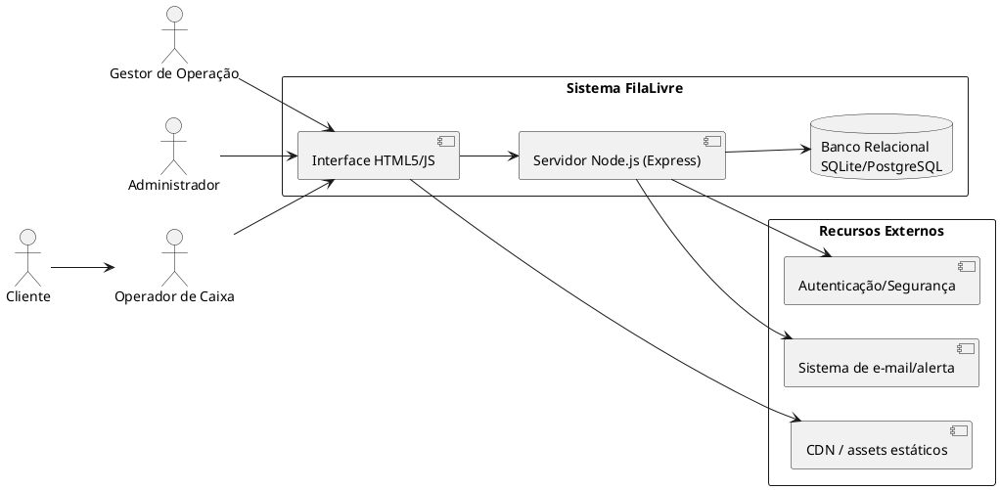
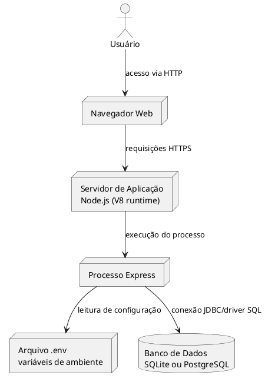
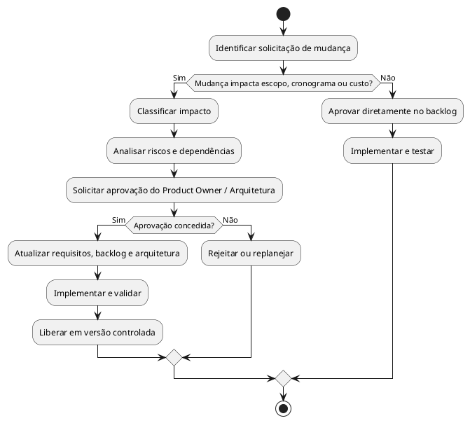

# Escopo do Projeto — FilaLivre

## 1. Justificativa de Engenharia e Objetivos SMART

### 1.1 Justificativa de Engenharia

A solução FilaLivre foi concebida para resolver um problema clássico de operação varejista: interrupção física do gestor em função da necessidade de autorização em pontos de atendimento. Em lojas com múltiplos caixas, a dependência de deslocamento gera perda de produtividade, aumento de tempo de espera para clientes e redução da capacidade operacional.

A engenharia da solução busca atender a três objetivos principais:
1. eliminar o deslocamento físico como requisito para autorização;
2. tornar a decisão do gestor centralizada e auditável;
3. manter o fluxo de atendimento confiável e transparente.

A arquitetura escolhida em stack Node.js + HTML5 + JS Vanilla + Express + banco relacional representa uma solução adequada para aplicações de gestão operacional com baixo custo de implantação, boa mantenabilidade e capacidade de integração a diferentes bancos relacionais.

### 1.2 Objetivos SMART

#### Objetivo 1: reduzir tempo médio de aprovação
- Específico: reduzir tempo de resposta de solicitações pendentes.
- Mensurável: reduzir tempo médio de aprovação para menos de 60 segundos em operação normal.
- Alcançável: com painel, notificação e processo de aprovação centralizado.
- Relevante: elimina perda operacional por deslocamento.
- Temporal: atingir meta em primeira entrega funcional.

#### Objetivo 2: melhorar visibilidade operacional
- Específico: centralizar status dos caixas e solicitações.
- Mensurável: painel exibe 100% dos caixas ativos e status atualizado.
- Alcançável: integração com banco e polling/atualização de interface.
- Relevante: facilita decisão do gestor.
- Temporal: presente na release inicial.

#### Objetivo 3: garantir rastreabilidade
- Específico: toda decisão deve ser registrada.
- Mensurável: 100% das decisões com usuário, horário e motivo.
- Alcançável: auditoria por evento e transação.
- Relevante: necessário para compliance e diagnóstico.
- Temporal: desde o primeiro ciclo de execução.

---

## 2. Delimitação das Fronteiras do Sistema

### 2.1 Diagrama de Contexto

### 2.2 Fronteira do Sistema
- Interface HTML5 client-side: definição da camada de interação e apresentação.
- Runtime Node.js: processamento, autenticação, roteamento, serviços e regras de negócio.
- Persistência: armazenamento relacional com prepared statements.
- Recursos externos: CDN, alertas e serviços autenticadores.

---

## 3. Escopo do Produto por Módulos Arquiteturais

### 3.1 Módulo 1 — Interface Front-End
- arquivos HTML5 semânticos:
  - index.html
  - caixa.html
  - painel.html
- arquivos CSS:
  - css/style.css
- arquivos JavaScript:
  - js/api.js
  - js/index.js
  - js/caixa.js
  - js/painel.js
- entregáveis:
  - telas de login, painel, operação do caixa e administração;
  - componentes visuais e estados de feedback;
  - integração com endpoints REST.

### 3.2 Módulo 2 — Camada de API / Backend
- estrutura de rotas Express:
  - /api/auth
  - /api/caixas
  - /api/solicitacoes
  - /api/relatorios
  - /api/auditoria
- middlewares:
  - autenticação;
  - autorização por perfil;
  - validação sanitizada de entrada;
  - rate limit;
  - logging;
  - tratamento de erros.
- entregáveis:
  - controladores, serviços, utilitários e modelos.

### 3.3 Módulo 3 — Camada de Persistência
- scripts SQL:
  - database/schema.sql
- modelos de dados:
  - usuarios
  - caixas
  - solicitacoes
  - registros_acao
- entregáveis:
  - DDL, constraints, indexes e seeds iniciais.

### 3.4 Módulo 4 — Governança e Auditoria
- trilha de eventos;
- logs de operações;
- rastreabilidade da decisão;
- métricas de negócio e de segurança.

---

## 4. Diagrama de Componentes UML 2.5.1

```plantuml
@startuml
left to right direction
skinparam componentStyle rectangle
skinparam shadowing false

component "HTML5 Client" as HTML
component "JS Vanilla (ES6+)" as JS
component "API REST\nExpress" as EXPRESS
component "Auth Middleware" as AUTH
component "Validation Middleware" as VALID
component "Controllers" as CTRL
component "Services / Rules" as SVC
component "Persistence Layer\nPrepared Statements" as DAO
database "Relational DB\nSQLite/PostgreSQL" as DB

HTML ..> JS : "eventos / renderização"
JS --> EXPRESS : "HTTP JSON"
EXPRESS --> AUTH : "provided interface"
EXPRESS --> VALID : "provided interface"
EXPRESS --> CTRL : "provided interface"
CTRL --> SVC : "required interface"
SVC --> DAO : "required interface"
DAO --> DB : "SQL + prepared statements"
AUTH ..> CTRL : "security check"
VALID ..> CTRL : "sanitização e validação"
@enduml
```

### 4.1 Portas e Interfaces Providas/Requeridas
- Interface HTML5/JS fornece interação do usuário e consumo de APIs.
- Express fornece interface HTTP REST para cliente.
- Auth middleware requer contexto de sessão/usuário.
- DAO requer um banco relacional e implementa acesso preparado.
- Controllers requerem serviços de regra de negócio.

---

## 5. Diagrama de Implantação (Deployment Diagram)

### 5.1 Mapeamento físico
- cliente: navegador com client-side HTML/JS;
- processo Node.js: runtime V8 executando Express;
- arquivo .env: parâmetros de infra e segredos;
- banco: armazenamento relacional local ou em provedor externo;
- observações:
  - não deve haver segredo exposto no código fonte;
  - não deve haver conexão direta do front-end com banco.

---

## 6. Estrutura Analítica do Projeto (EAP / WBS)

### 6.1 EAP em formato hierárquico

1. Projeto FilaLivre
   1.1. Levantamento de requisitos
   1.1.1. Identificação dos atores
   1.1.2. Casos de uso e fluxos principais
   1.1.3. Regras de negócio e critérios de aceite
   1.2. Arquitetura e design
   1.2.1. Modelagem de domínio
   1.2.2. Definição de APIs REST
   1.2.3. Diagrama de componentes e implantação
   1.3. Desenvolvimento do front-end
   1.3.1. HTML5 semântico
   1.3.2. CSS3 e layout responsivo
   1.3.3. JS para consumo de APIs
   1.4. Desenvolvimento do backend
   1.4.1. Serviços de autenticação
   1.4.2. Controladores e rotas
   1.4.3. Lógica de aprovação/recusa
   1.4.4. Tratamento de auditoria
   1.5. Persistência e dados
   1.5.1. DDL e seeds iniciais
   1.5.2. Índices e constraints
   1.5.3. Prepared statements
   1.6. Segurança e conformidade
   1.6.1. Senhas hash
   1.6.2. Padrões de autorização
   1.6.3. Logs e auditoria
   1.7. Testes e validação
   1.7.1. Testes de API
   1.7.2. Testes de regras de negócio
   1.7.3. Testes de integração com banco
   1.8. Entrega e operação
   1.8.1. Deploy local e ambiente de produção
   1.8.2. Monitoramento e alertas
   1.8.3. Gestão de mudança e evolução

### 6.2 Dicionário de Entregáveis

| Entregável | Tipo | Responsável | Critério de conclusão |
|---|---|---|---|
| Especificação de requisitos | Documento | Product/Arquitetura | aprovado por stakeholders |
| Diagramas UML | Artefato | Arquitetura | revisados e versionados |
| Front-end HTML/JS | Código | Front-end | telas operáveis |
| Back-end Express | Código | Backend | APIs em funcionamento |
| Banco de dados | Script SQL | Data/Backend | schema estável |
| Auditoria | Módulo | Backend | registros de decisões |
| Testes | Automação | QA/Backend | execução com sucesso |

---

## 7. Limites Explícitos do Projeto

### 7.1 Dentro do Escopo (In-Scope)
- autenticação e autorização por perfil;
- painel de caixas e status operacional;
- criação, aprovação e recusa de solicitações;
- registro de ações e histórico;
- relatórios operacionais básicos;
- interface em HTML5/JS para uso no navegador;
- persistência relacional com prepared statements;
- segurança mínima e auditoria.

### 7.2 Fora do Escopo (Out-of-Scope)
- integração com ERP ou CRM de terceiros;
- autenticação SSO com provedores externos na etapa inicial;
- gateway de pagamento;
- chat em tempo real em nível avançado;
- suporte a mobile app nativo;
- processamento analítico avançado com data lake;
- automatização de visão computacional;
- módulo de BI empresarial sofisticado.

### 7.3 Riscos de Scope Creep
- adicionar novas regras de negócio sem revisão de impacto;
- incluir novos módulos de negócio fora do processo de aprovação;
- alterar requisitos de UX sem aprovação formal;
- estender o sistema para suporte multi-loja sem priorização formal.

---

## 8. Matriz de Critérios de Aceitação, Restrições/Premissas e Riscos Técnicos

### 8.1 Matriz de Critérios de Aceitação (CA)

| ID | Critério | Critério de Aceitação |
|---|---|---|
| CA-01 | Login | usuário autenticado só com credenciais válidas |
| CA-02 | Painel | painel exibe ao menos todos os caixas ativos |
| CA-03 | Solicitação | registro válido só com campos obrigatórios |
| CA-04 | Aprovação | gestor pode aprovar somente solicitações pendentes |
| CA-05 | Recusa | recusa exige motivo e registra decisão |
| CA-06 | Auditoria | 100% das mudanças geram evento de auditoria |
| CA-07 | Segurança | senha nunca armazenada em texto claro |
| CA-08 | Perfomance | listagens principais respondem em tempo aceitável |

### 8.2 Matriz de Restrições e Premissas

| Tipo | Item |
|---|---|
| Restrição | uso de Node.js LTS |
| Restrição | banco relacional com suporte a prepared statements |
| Restrição | interface principal em navegador web |
| Premissa | usuários possuem perfis bem definidos |
| Premissa | empresa tem caixa físico e operador no ponto de venda |
| Premissa | ambiente de produção suporta PostgreSQL ou SQLite |
| Premissa | regras de negócio serão estáveis no ciclo inicial |

### 8.3 Matriz de Riscos Técnicos com Mitigação

| Risco | Impacto | Probabilidade | Mitigação |
|---|---|---|---|
| Event loop blocking | lentidão e indisponibilidade | Média | otimizar I/O, limitar processamento síncrono |
| Injeção de SQL | perda de integridade | Média | prepared statements e validação |
| Concorrência de I/O | inconsistência em atualização | Média | transações e bloqueios mínimos |
| Session fixation | invasão de sessão | Baixa | regeneração de sessão e expiração |
| Falha de rede com banco | indisponibilidade parcial | Média | retry, tratamento de erro e timeouts |
| vazamento de segredo em .env | comprometimento | Média | .env em ambiente protegido e gitignore |

---

## 9. Governança e Processo de Controle de Mudanças de Escopo

### 9.1 Princípios de Governança
- todo requisito novo deve ser classificado por impacto;
- alterações não previstas exigem aprovação formal;
- critérios de aceite e risco devem ser revisados antes da mudança;
- qualquer mudança de escopo deve ser registrada em documento de controle;
- backups e versionamento devem acompanhar alterações de schema e código.

### 9.2 Diagrama de Atividades de Controle de Mudanças

### 9.3 Fluxo de Registro
- solicitação de mudança;
- análise de impacto;
- aprovação/reprovação;
- atualização de artefatos;
- versionamento e comunicação à equipe.

---

## 10. Conclusão

O escopo do projeto foi delimitado para atender à necessidade operacional principal: permitir que o gestor autorize ações remotas sem deslocamento físico. A arquitetura proposta combina simplicidade de desenvolvimento, clareza de domínio, segurança, rastreabilidade e governança, respeitando limites de escopo para evitar expansão indevida do produto.
