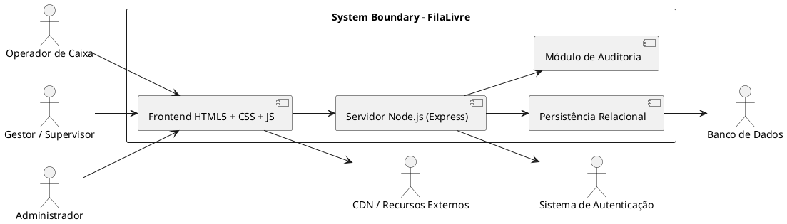
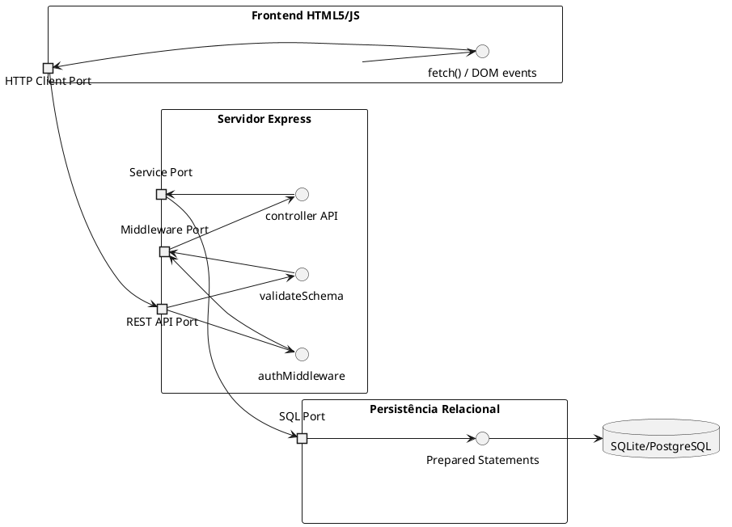
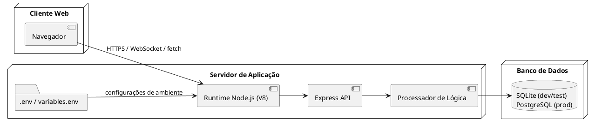
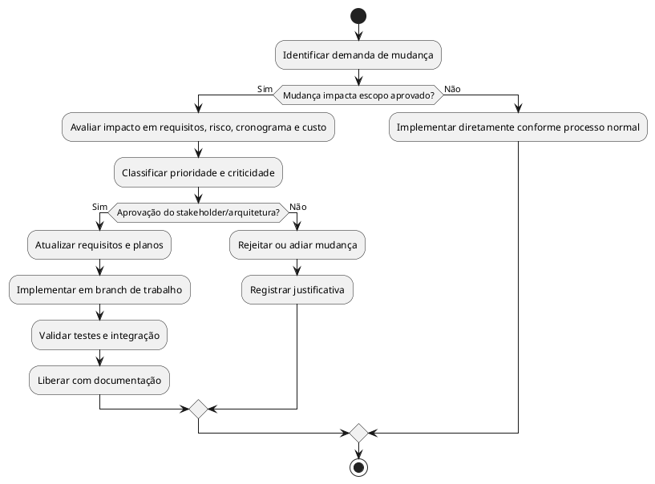

# Escopo do Projeto — FilaLivre

## 1. Justificativa de Engenharia e Objetivos SMART

### 1.1 Justificativa de Engenharia

A operação de supermercados e varejistas exige estabilidade operacional, clareza de decisões e agilidade no atendimento. Em contextos de alta demanda, a necessidade de validação de ações em caixa por parte do gestor ou supervisor gera interrupções manuais e tempo de espera no atendimento ao cliente. O projeto FilaLivre foi concebido para reduzir esse gargalo por meio de um mecanismo digital de autorização remota.

A solução adota uma arquitetura full-stack composta por:

- Frontend em HTML5 semântico, CSS3 e JavaScript ES6+
- Backend em Node.js com framework Express
- Banco relacional com suporte a SQLite para desenvolvimento e PostgreSQL para produção
- Prepared Statements para garantir segurança e integridade das consultas
- Camada de auditoria para rastrear cada decisão e ação relevante

A justificativa técnica está em combinar simplicidade operacional, baixo custo de manutenção e alta capacidade de resposta sem exigir infraestrutura complexa. A solução é apropriada para pequenos e médios varejistas, além de ambientes administrativos e de ponta de operação com múltiplos caixas.

### 1.2 Objetivos SMART

#### Objetivo 1: reduzir tempo de espera em operações de autorização
- Específico: permitir que o gestor valide solicitações de autorização sem deslocamento ao caixa.
- Mensurável: reduzir em 60% o tempo de resolução de solicitações críticas.
- Alcançável: via fluxo digital de aprovação e recusa em tempo real.
- Relevante: impacta diretamente a experiência do cliente e a produtividade.
- Temporal: até o fim do ciclo de entrega do MVP.

#### Objetivo 2: centralizar decisões e rastreabilidade
- Específico: registrar cada aprovação, recusa e ação relevante em trilha de auditoria.
- Mensurável: 100% das ações críticas gravadas com usuário, caixa, momento e resultado.
- Alcançável: com camada de auditoria e persistência estruturada.
- Relevante: fortalece conformidade operacional.
- Temporal: no MVP e em versões subsequentes.

#### Objetivo 3: garantir segurança e integridade de acesso
- Específico: autenticação por perfil, autorização por papel e validação das entradas.
- Mensurável: 100% das rotas protegidas com autenticação e políticas adequadas.
- Alcançável: por middleware, serviços de sessão e validação em schema.
- Relevante: reduz risco de abuso e vazamento de informação.
- Temporal: desde a primeira release.

#### Objetivo 4: manter a solução simples e operável
- Específico: usar stack leve e interface funcional em navegador.
- Mensurável: interface navegável sem treinamento extensivo em 15 minutos.
- Alcançável: com HTML5 semântico, CSS orientado a clareza e JavaScript leve.
- Relevante: facilita adoção.
- Temporal: em todos os ciclos de implementação.

---

## 2. Delimitação das Fronteiras do Sistema (System Boundary)

### 2.1 Contexto de Sistema

O sistema FilaLivre compreende a interface de usuários, o backend de processamento, a persistência relacional e o uso de serviços auxiliares. A fronteira do sistema isola o ambiente de operação do varejo e separa os atores externos dos componentes internos.

### 2.2 Fronteiras explícitas

Dentro do sistema:
- login e autenticação
- criação e consulta de solicitações
- tomada de decisão por gestor
- histórico e relatórios
- regra de auditoria
- interface web e lógica de operação

Fora do sistema:
- rede de internet pública
- infraestrutura de hosting
- provedores de CDN e bibliotecas externas
- sistema de e-mail, push ou notificações de terceiros
- banco de dados externo gerenciado fora do componente do projeto

---

## 3. Escopo do Produto por Módulos Arquiteturais e Entregáveis Físicos

### 3.1 Módulo 1 — Interface Web e Cliente
Entregáveis físicos:
- frontend/index.html
- frontend/caixa.html
- frontend/painel.html
- frontend/css/style.css
- frontend/js/api.js
- frontend/js/index.js
- frontend/js/caixa.js
- frontend/js/painel.js

Responsabilidades:
- autenticação e redirecionamento
- leitura e envio de dados via fetch
- renderização do painel operacional
- exibição de toasts, status e notificações
- interação do operador e do gestor

### 3.2 Módulo 2 — API e Servidor Node.js
Entregáveis físicos:
- backend/app.js
- backend/routes/auth.routes.js
- backend/routes/caixa.routes.js
- backend/routes/solicitacao.routes.js
- backend/routes/usuario.routes.js
- backend/routes/relatorio.routes.js
- backend/middleware/auth.middleware.js
- backend/middleware/error.middleware.js
- backend/middleware/sanitize.middleware.js
- backend/middleware/validate.middleware.js

Responsabilidades:
- autenticação e autorização
- validação de payloads
- roteamento de recursos
- orquestração de serviços e respostas
- controle de falhas e mensagens de erro

### 3.3 Módulo 3 — Serviços e Regras de Negócio
Entregáveis físicos:
- backend/services/auth.service.js
- backend/services/caixa.service.js
- backend/services/solicitacao.service.js
- backend/services/relatorio.service.js
- backend/services/auditoria.service.js

Responsabilidades:
- regras de negócio de autorização
- transição de estados
- geração de alertas e notificações
- composição de dados para relatórios

### 3.4 Módulo 4 — Persistência e Banco de Dados
Entregáveis físicos:
- database/schema.sql
- database/seed.sql
- database/migrations/
- backend/config/db.js
- backend/repositories/*.js

Responsabilidades:
- persistência de usuários, caixas e solicitações
- leitura de histórico
- consultas otimizadas por filtros e índices
- uso de prepared statements

### 3.5 Módulo 5 — Auditoria e Telemetria
Entregáveis físicos:
- backend/services/auditoria.service.js
- backend/logger.js
- backend/config/logger.js
- database/schema.sql (registros_acao)

Responsabilidades:
- gravar ações e decisões
- manter trilha evidencial
- permitir inspeção por auditoria e compliance

---

## 4. Diagrama de Componentes UML 2.5.1

### 4.1 Portas e interfaces

- Porta HTTP do cliente: recebe eventos, consultas e ações do usuário.
- Porta da API: expõe endpoints REST com JSON.
- Porta de Middleware: valida autenticação, sanitização e autorização.
- Porta de Serviços: conecta controller com regras de negócio.
- Porta SQL: executa consultas preparadas e persistência transacional.

---

## 5. Diagrama de Implantação (Deployment Diagram)

### 5.1 Mapeamento físico
- Navegador: executa frontend HTML5/JS.
- Runtime Node.js: permanece responsável por alojar a aplicação Express.
- Variáveis de ambiente: armazenam credenciais, strings de conexão e flags de ambiente.
- Banco: persiste usuários, caixa, solicitações e registros de auditoria.

---

## 6. Estrutura Analítica do Projeto (EAP / WBS)

### 6.1 EAP em formato hierárquico

1. Projeto FilaLivre
   1.1 Planejamento e Arquitetura
   1.1.1 Levantamento de requisitos
   1.1.2 Modelagem de casos de uso
   1.1.3 Definição de arquitetura e tecnologias
   1.2 Frontend
   1.2.1 Interface de login e dashboard
   1.2.2 Painel de caixas e solicitações
   1.2.3 Histórico e relatórios
   1.3 Backend
   1.3.1 Roteamento REST
   1.3.2 Middlewares de autenticação e sanitização
   1.3.3 Serviços de domínio e regras de negócio
   1.3.4 Relatórios e consulta
   1.4 Persistência
   1.4.1 Esquema de banco
   1.4.2 Migrations e seed
   1.4.3 Índices e constraints
   1.5 Segurança e Auditoria
   1.5.1 Hash de senhas
   1.5.2 Autorização por perfil
   1.5.3 Registro de trilha de eventos
   1.6 Testes e Validação
   1.6.1 Testes unitários
   1.6.2 Testes de integração
   1.6.3 Validação de cenários críticos
   1.7 Entrega e Governança
   1.7.1 Reuniões de revisão
   1.7.2 Controle de escopo
   1.7.3 Liberação e regressão

### 6.2 Dicionário de entregáveis

| Código | Entregável | Tipo | Responsável |
|---|---|---|---|
| E01 | Requisitos e casos de uso | Documento | Arquitetura/Negócio |
| E02 | Interface web | Código | Frontend |
| E03 | Rotas e controllers | Código | Backend |
| E04 | Serviços e regras | Código | Backend |
| E05 | Schema SQL | Código | Dados |
| E06 | Auditoria | Código e logs | Backend |
| E07 | Testes | Script/código | QA/Engenharia |
| E08 | Release | Pacote de entrega | Gestão |

---

## 7. Limites Explícitos do Projeto

### 7.1 Dentro do Escopo (In-Scope)
- autenticação de usuários por e-mail e senha
- painel de caixas e solicitações pendentes
- criação de solicitações de autorização
- aprovação e recusa por gestor
- histórico de decisões
- relatórios básicos por caixa e operador
- auditoria de ações críticas
- controle por perfil e permissão
- persistência relacional com checks e constraints
- interface web responsiva e acessível

### 7.2 Fora do Escopo (Out-of-Scope)
- sistema de pagamento financeiro integrado
- checkout automatizado de loja
- integração com ERPs de varejo externos
- processamento de imagem ou OCR
- analytics avançado de mercado
- suporte a múltiplas filiais com disponibilidade distribuída complexa
- autenticação via OAuth externo no MVP
- integração com CRM de clientes ou fornecedores
- inteligência artificial para decisão automatizada
- sincronização offline avançada com conflitos de dados

> A disciplina do escopo é essencial para evitar Scope Creep e manter previsibilidade de entrega.

---

## 8. Matriz de Critérios de Aceitação (CA), Restrições/Premissas e Riscos Técnicos

### 8.1 Matriz de Critérios de Aceitação

| ID | Critério | Evidência de Aceitação |
|---|---|---|
| CA-01 | login com credenciais válidas | resposta 200 e redirecionamento |
| CA-02 | login inválido | resposta 401 e mensagem clara |
| CA-03 | solicitação criada | 201 Created e persistência |
| CA-04 | solicitação pendente | status PENDENTE e notificação |
| CA-05 | aprovação registra decisão | update status + auditoria |
| CA-06 | recusa exige motivo | recusa válida e registro no log |
| CA-07 | gestor vê painel consolidado | listagem e ordenação corretas |
| CA-08 | relatório exibe dados consistentes | filtros e agregações corretas |

### 8.2 Matriz de Restrições / Premissas

| Tipo | Item | Impacto |
|---|---|---|
| Restrição | Stack limitada a Node.js + Express + JS | reduz complexidade arquitetural |
| Restrição | Banco relacional obrigatório | simplifica consultas e consistência |
| Premissa | Usuários possuem perfis bem definidos | facilita autorização |
| Premissa | Ambiente de operação exige autonomia de gestor | favorece aprovações remotas |
| Premissa | Estabelecimento tem caixa físico e fluxo de atendimento | define contexto operacional |

### 8.3 Matriz de Riscos Técnicos e Mitigações

| Risco | Descrição | Probabilidade | Impacto | Mitigação |
|---|---|---|---|---|
| Event Loop blocking | processamento pesado bloqueia I/O | Média | Alto | evitar loops longos em callback e usar filas |
| SQL Injection | consulta insegura | Média | Crítico | Prepared Statements e validação |
| Conflito de concorrência | múltiplas decisões em paralelo | Média | Alto | transações e lock por row |
| Injeção de código | payload malicioso do cliente | Média | Crítico | sanitização e schema validation |
| Falha de persistência | banco indisponível | Baixa | Alto | retry e fallback com logs |
| Sobrecarga de UI | múltiplos eventos simultâneos | Média | Médio | debounce e carregamento parcial |

---

## 9. Governança e Processo de Controle de Mudanças de Escopo

### 9.1 Governança

A governança do projeto deve ser orientada por quatro princípios:

1. clareza do escopo
2. rastreabilidade de requisitos
3. revisão de impactos antes da implementação
4. consistência do conjunto de entregáveis

### 9.2 Processo de controle de mudanças

- Solicitação de mudança: inicia com demanda de negócio, correção de falha ou ajuste técnico.
- Análise de impacto: avalia impactos em funcionalidade, dados, segurança e cronograma.
- Priorização: classifica em crítico, alto, médio ou baixo.
- Aprovação: requer consenso de arquiteto e stakeholder responsável.
- Implementação: segue processo de branching, revisão e validação.
- Registro: a mudança deve ser documentada em log de projeto com razão e data.

### 9.3 Diagrama de Atividades de Mudança de Escopo (PlantUML)

---

## 10. Conclusão

O escopo do projeto FilaLivre foi definido para atender ao problema real de operação em frente de caixa: reduzir o tempo de espera, aprimorar a supervisão remota, garantir rastreabilidade e manter a solução tecnológica acessível e segura. A arquitetura proposta valoriza simplicidade, clareza de responsabilidades, governança de requisitos e mitigação de riscos. O compromisso com a definição rigorosa de limites, obrigações e entregáveis é fator decisivo para a entrega bem-sucedida e para a estabilidade operacional do sistema.
