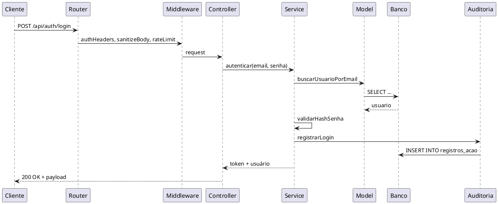
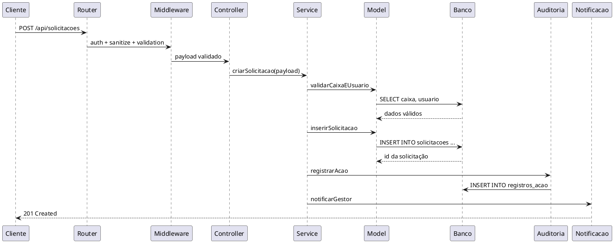
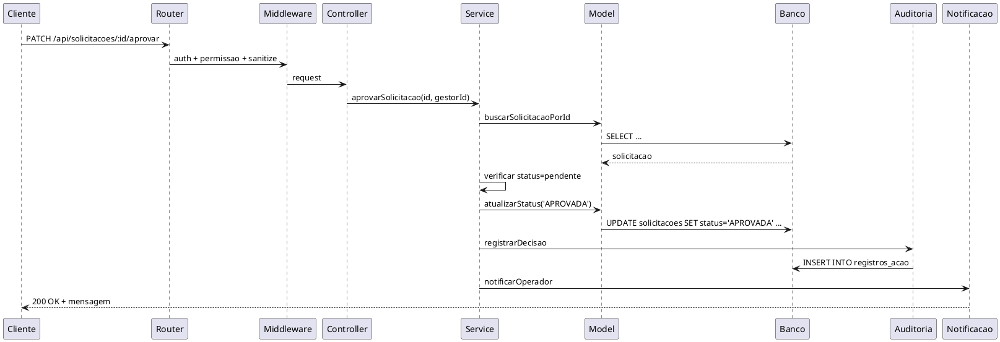
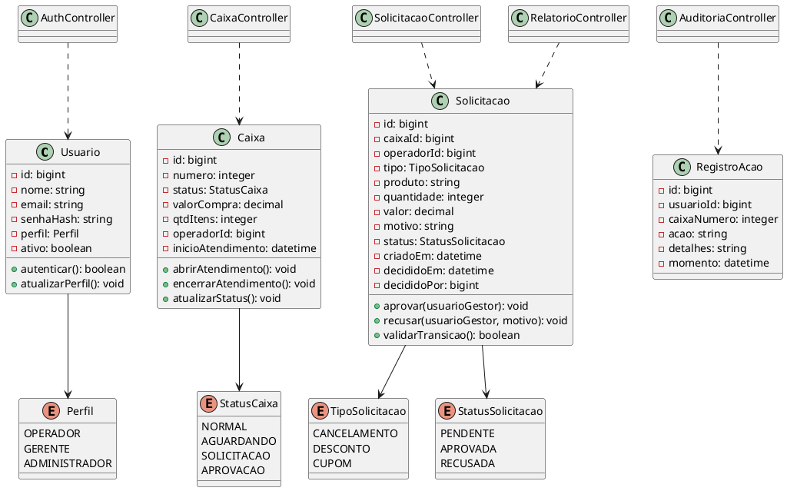

# Requisitos de Sistema — FilaLivre

## 1. Objetivo do Documento

Este documento detalha os requisitos de sistema do FilaLivre com foco técnico, integração, segurança, runtime Node.js + Express e persistência relacional. Os requisitos aqui descritos orientam arquitetura, desenvolvimento, testes, governança e operação em ambiente de produção.

A solução assume:
- backend em Node.js com Express;
- autenticação baseada em sessão ou JWT conforme estratégia de segurança;
- interface front-end em HTML5 semântico, CSS3 e JavaScript Vanilla/ES6+;
- banco de dados relacional SQLite em ambiente local ou PostgreSQL em produção;
- prepared statements para proteção contra SQL injection;
- auditoria de todas as decisões e ações de negócio.

---

## 2. Requisitos Funcionais de Sistema (RSF)

### 2.1 Visão Geral

Os requisitos funcionais abaixo detalham contratos, rotas, payloads, filtros e respostas esperadas. A camada de apresentação comunica-se com o backend por HTTP REST com JSON.

### 2.2 RSF-01 — Autenticação e Autorização

#### Rota: POST /api/auth/login
- Método: POST
- Autenticação: pública
- Payload JSON:
```json
{
  "email": "operador@filalivre.com",
  "senha": "senhaSegura123"
}
```
- Validações:
  - e-mail obrigatório e em formato válido;
  - senha obrigatória;
  - usuário deve existir e estar ativo;
  - senha validada por hash seguro (bcrypt/argon2).
- Resposta esperada:
  - 200 OK com payload de sessão/token;
  - 401 Unauthorized em credencial inválida.

#### Rota: POST /api/auth/logout
- Método: POST
- Autenticação: obrigatória
- Resposta esperada:
  - 204 No Content em sucesso.

#### Rota: POST /api/auth/cadastro
- Método: POST
- Autenticação: pública (ou restrita para administrador, conforme estratégia)
- Payload JSON:
```json
{
  "nome": "Novo Operador",
  "email": "novo@filalivre.com",
  "senha": "Senha123!",
  "perfil": "OPERADOR"
}
```
- Códigos HTTP:
  - 201 Created em sucesso;
  - 400 Bad Request em payload inválido;
  - 409 Conflict em e-mail duplicado.

### 2.3 RSF-02 — Painel de Caixas

#### Rota: GET /api/caixas
- Método: GET
- Autenticação: obrigatória
- Query params opcionais:
  - status
  - numero
  - operadorId
- Resposta esperada:
```json
[
  {
    "id": 1,
    "numero": 3,
    "status": "NORMAL",
    "valorCompra": 145.80,
    "qtdItens": 5,
    "operadorId": 8,
    "inicioAtendimento": "2026-09-01T12:00:00Z"
  }
]
```
- Status:
  - 200 OK;
  - 401 Unauthorized se sessão inválida.

#### Rota: GET /api/caixas/:id
- Método: GET
- Retorna detalhes do caixa e estado operacional.

### 2.4 RSF-03 — Gestão de Solicitações

#### Rota: POST /api/solicitacoes
- Método: POST
- Autenticação: obrigatória
- Payload JSON:
```json
{
  "caixaId": 3,
  "tipo": "CANCELAMENTO",
  "produto": "Arroz 5kg",
  "quantidade": 1,
  "valor": 24.90,
  "motivo": "Produto com código divergente",
  "operadorId": 8
}
```
- Validações:
  - caixa deve existir e estar ativo;
  - tipo deve ser um enum válido;
  - produto e motivo não podem ser vazios;
  - valor e quantidade consistentes com regras de negócio.
- Resposta esperada:
  - 201 Created com JSON do objeto persistido;
  - 400 Bad Request para payload inválido;
  - 404 Not Found para caixa inexistente.

#### Rota: GET /api/solicitacoes
- Método: GET
- Autenticação: obrigatória
- Filtros:
  - status
  - caixaId
  - operadorId
  - periodoInicial / periodoFinal
- Resposta esperada:
```json
[
  {
    "id": 55,
    "caixaId": 3,
    "operadorId": 8,
    "tipo": "DESCONTO",
    "produto": "Café torrado",
    "quantidade": 2,
    "valor": 18.60,
    "status": "PENDENTE",
    "criadoEm": "2026-09-01T12:15:00Z"
  }
]
```

#### Rota: PATCH /api/solicitacoes/:id/aprovar
- Método: PATCH
- Autenticação: obrigatória
- Permissão: gestor/admin
- Payload opcional:
```json
{
  "decisao": "APROVADA",
  "observacao": "Autorizado por motivo de divergência documental"
}
```
- Código HTTP:
  - 200 OK em sucesso;
  - 403 Forbidden sem permissão;
  - 409 Conflict se status não for pendente.

#### Rota: PATCH /api/solicitacoes/:id/recusar
- Método: PATCH
- Autenticação: obrigatória
- Permissão: gestor/admin
- Observação obrigatória preferencialmente.
- Resposta esperada: 200 OK ou 400 Bad Request se observação ausente.

### 2.5 RSF-04 — Relatórios e Auditoria

#### Rota: GET /api/relatorios/resumo
- Método: GET
- Autenticação: obrigatória
- Retorna resumo por caixa, status e número de solicitações.

#### Rota: GET /api/auditoria
- Método: GET
- Autenticação: obrigatória
- Restringido a administradores e supervisores.
- Retorna trilha de eventos e alterações.

### 2.6 RSF-05 — Usuários e Perfis

#### Rota: GET /api/usuarios
- Método: GET
- Autenticação: obrigatória
- Restrições por perfil.

#### Rota: PUT /api/usuarios/:id
- Método: PUT
- Gestão de dados cadastrais e perfis.

---

## 3. Requisitos Não Funcionais (RSNF) classificados pela taxonomia FURPS+ / ISO/IEC 25010

### 3.1 Funcionalidade (F)
- sistema deve permitir autenticação segura;
- fluxo de autorização sem deslocamento físico;
- registros de auditoria obrigatórios;
- painel de visão centralizada;
- manutenção de usuário e perfis.

### 3.2 Usabilidade (U)
- interface responsiva para desktop e tablet;
- feedback visual para ações relevantes;
- navegação clara com estados visuais (pendente, aprovada, recusada);
- tempos de resposta perceptíveis abaixo de 2 a 3 segundos em operação normal.

### 3.3 Confiabilidade (R)
- integrações devem tratar falhas de rede/perda de conexão;
- transações de alteração devem ser consistentes;
- banco deve manter integridade referencial;
- fallback para telas de erro e logs estruturados.

### 3.4 Performance (P)
- listagens de painel devem responder em menos de 1 segundo em datasets pequenos/medianos;
- consultas devem usar índices em filtros frequentes (status, caixa_id, operador_id);
- consultas massivas devem paginar com limite máximo de registros por página.

### 3.5 Suporte (S)
- arquitetura modular e separação de responsabilidades;
- logs de camada e rastreio por request id;
- componente de auditoria fácil de extendê-lo para outros módulos.

### 3.6 + (FURPS+)
- Compatibilidade: suportar navegador moderno e Node.js LTS;
- Segurança: autenticação, autorização, sanitização, prepared statements, rate limiting;
- Portabilidade: funcional em SQLite local e PostgreSQL em produção;
- Internacionalização: textos em português e extensibilidade;
- Conformidade: política de dados e rastreabilidade.

### 3.7 ISO/IEC 25010

#### Segurança
- confidencialidade: dados sensíveis protegidos em sessão e armazenamento;
- integridade: validações de dados, transações;
- não-repúdio: auditoria obrigatória;
- autenticação forte e autorização por perfil.

#### Performance Efficiency
- tempo de resposta aceitável;
- throughput suficiente para atendimento em loja;
- uso eficiente de memória e I/O.

#### Reliability
- disponibilidade operacional;
- capacidade de recuperação;
- consistência de dados.

#### Usability
- aprendibilidade e eficiência de uso;
- preventividade de erros;
- feedback de estado.

#### Maintainability
- organização por módulos;
- design de serviços e controladores isolados;
- uso de interfaces e serviços testáveis.

#### Portability
- runtime Node.js LTS;
- banco adaptável com driver correspondente;
- execução em ambientes locais e cloud.

---

## 4. Diagramas de Sequência Dinâmicos do Backend

### 4.1 Fluxo de Login



### 4.2 Fluxo de Cadastro de Solicitação



### 4.3 Fluxo de Aprovação / Recusa



---

## 5. Diagrama Estrutural de Classes de Domínio e Controladores



### 5.1 Invariantes OCL

#### Invariante 1: transição válida de status da solicitação
```ocl
context Solicitacao
inv StatusValido:
  self.status = 'PENDENTE' or self.status = 'APROVADA' or self.status = 'RECUSADA'
```

#### Invariante 2: aprovação só com gestor
```ocl
context Solicitacao
inv AprovacaoPermitida:
  self.status = 'APROVADA' implies self.decididoPor <> null and self.decididoPor.perfil = 'GERENTE'
```

#### Invariante 3: recusa precisa de motivo
```ocl
context Solicitacao
inv RecusaComMotivo:
  self.status = 'RECUSADA' implies self.motivo <> null and self.motivo.trim().size() > 0
```

#### Invariante 4: caixa não pode ter status inconsistente
```ocl
context Caixa
inv StatusCaixaValido:
  self.status = 'NORMAL' or self.status = 'AGUARDANDO' or self.status = 'SOLICITACAO' or self.status = 'APROVACAO'
```

---

## 6. Dicionário Técnico de Dados

### 6.1 Tabela usuarios
```sql
CREATE TABLE usuarios (
  id BIGSERIAL PRIMARY KEY,
  nome VARCHAR(180) NOT NULL,
  email VARCHAR(180) NOT NULL UNIQUE,
  senha_hash VARCHAR(255) NOT NULL,
  perfil VARCHAR(30) NOT NULL CHECK (perfil IN ('OPERADOR','GERENTE','ADMINISTRADOR')),
  ativo BOOLEAN NOT NULL DEFAULT TRUE,
  criado_em TIMESTAMPTZ NOT NULL DEFAULT NOW(),
  atualizado_em TIMESTAMPTZ NOT NULL DEFAULT NOW()
);
CREATE INDEX idx_usuarios_email ON usuarios(email);
```

### 6.2 Tabela caixas
```sql
CREATE TABLE caixas (
  id BIGSERIAL PRIMARY KEY,
  numero INTEGER NOT NULL UNIQUE,
  status VARCHAR(30) NOT NULL DEFAULT 'NORMAL' CHECK (status IN ('NORMAL','AGUARDANDO','SOLICITACAO','APROVACAO')),
  valor_compra DECIMAL(12,2) NOT NULL DEFAULT 0,
  qtd_itens INTEGER NOT NULL DEFAULT 0,
  operador_id BIGINT NULL,
  inicio_atendimento TIMESTAMPTZ NULL,
  CONSTRAINT fk_caixas_operador FOREIGN KEY (operador_id) REFERENCES usuarios(id)
);
CREATE INDEX idx_caixas_status ON caixas(status);
CREATE INDEX idx_caixas_numero ON caixas(numero);
```

### 6.3 Tabela solicitacoes
```sql
CREATE TABLE solicitacoes (
  id BIGSERIAL PRIMARY KEY,
  caixa_id BIGINT NOT NULL,
  operador_id BIGINT NOT NULL,
  tipo VARCHAR(30) NOT NULL CHECK (tipo IN ('CANCELAMENTO','DESCONTO','CUPOM')),
  produto VARCHAR(180) NOT NULL,
  quantidade INTEGER NULL,
  valor DECIMAL(12,2) NULL,
  motivo VARCHAR(500) NULL,
  status VARCHAR(30) NOT NULL DEFAULT 'PENDENTE' CHECK (status IN ('PENDENTE','APROVADA','RECUSADA')),
  criado_em TIMESTAMPTZ NOT NULL DEFAULT NOW(),
  decidido_em TIMESTAMPTZ NULL,
  decidido_por BIGINT NULL,
  CONSTRAINT fk_solicitacoes_caixa FOREIGN KEY (caixa_id) REFERENCES caixas(id),
  CONSTRAINT fk_solicitacoes_operador FOREIGN KEY (operador_id) REFERENCES usuarios(id),
  CONSTRAINT fk_solicitacoes_decisor FOREIGN KEY (decidido_por) REFERENCES usuarios(id)
);
CREATE INDEX idx_solicitacoes_status ON solicitacoes(status);
CREATE INDEX idx_solicitacoes_caixa_id ON solicitacoes(caixa_id);
CREATE INDEX idx_solicitacoes_operador_id ON solicitacoes(operador_id);
```

### 6.4 Tabela registros_acao
```sql
CREATE TABLE registros_acao (
  id BIGSERIAL PRIMARY KEY,
  usuario_id BIGINT NOT NULL,
  caixa_numero INTEGER NULL,
  acao VARCHAR(80) NOT NULL,
  detalhes VARCHAR(500) NULL,
  momento TIMESTAMPTZ NOT NULL DEFAULT NOW(),
  CONSTRAINT fk_registros_usuario FOREIGN KEY (usuario_id) REFERENCES usuarios(id)
);
CREATE INDEX idx_registros_acao_usuario ON registros_acao(usuario_id);
CREATE INDEX idx_registros_acao_momento ON registros_acao(momento);
```

### 6.5 Observações de projeto
- todas as chaves primárias devem ser BIGSERIAL para escalabilidade;
- operações críticas devem usar transações;
- timezones devem ser persistidas em UTC com Normalização de horário;
- prepared statements são obrigatórios para toda inserção/atualização dinâmica;
- índices cobrem os principais filtros por status, caixa e operador.

---

## 7. Contratos de API RESTful

### 7.1 Rotas Públicas

| Método | Rota | Descrição | Status | Observações |
|---|---|---|---|---|
| POST | /api/auth/login | Login do usuário | 200/401 | aceita e-mail e senha |
| POST | /api/auth/cadastro | Cadastro inicial | 201/400/409 | apenas em fluxo controlado |
| GET | /api/health | Verificação de saúde do sistema | 200 | para monitoramento |

### 7.2 Rotas Protegidas (Operador / Gestor / Admin)

| Método | Rota | Permissão | Descrição |
|---|---|---|---|
| GET | /api/caixas | Operador/Gestor/Admin | lista caixas |
| GET | /api/caixas/:id | Operador/Gestor/Admin | detalhes do caixa |
| POST | /api/solicitacoes | Operador | cria solicitação |
| GET | /api/solicitacoes | Operador/Gestor/Admin | histórico e filtro |
| PATCH | /api/solicitacoes/:id/aprovar | Gestor/Admin | aprova |
| PATCH | /api/solicitacoes/:id/recusar | Gestor/Admin | recusa |
| GET | /api/relatorios/resumo | Gestor/Admin | resumo operacional |
| GET | /api/auditoria | Gestor/Admin | consulta auditoria |
| GET | /api/usuarios | Admin | consulta usuários |
| PUT | /api/usuarios/:id | Admin | edição de usuário |

### 7.3 Códigos de Status esperados

- 200 OK — operação concluída com sucesso;
- 201 Created — recurso criado;
- 204 No Content — operação sem retorno; logout;
- 400 Bad Request — payload inválido ou validação falhou;
- 401 Unauthorized — autenticação ausente ou inválida;
- 403 Forbidden — acesso não autorizado;
- 404 Not Found — recurso inexistente;
- 409 Conflict — conflito de regra de negócio;
- 500 Internal Server Error — falha não tratada.

---

## 8. Matriz Bidirecional de Rastreabilidade Técnica

| Requisito de Usuário | Requisito de Sistema | Rota / Módulo | Banco / Entidade |
|---|---|---|---|
| RU-01 Login | RSF-01, RSNF-Segurança | /api/auth/login | usuarios |
| RU-02 Painel | RSF-02 | /api/caixas | caixas |
| RU-03 Solicitação | RSF-03 | /api/solicitacoes | solicitacoes |
| RU-04 Status | RSF-03 | /api/solicitacoes | solicitacoes |
| RU-05 Pendentes | RSF-03 | /api/solicitacoes | solicitacoes |
| RU-06 Aprovação | RSF-03 | /api/solicitacoes/:id/aprovar | solicitacoes, registros_acao |
| RU-07 Recusa | RSF-03 | /api/solicitacoes/:id/recusar | solicitacoes, registros_acao |
| RU-08 Relatório | RSF-04 | /api/relatorios/resumo | solicitacoes, caixas |
| RU-09 Usuários | RSF-05 | /api/usuarios | usuarios |
| RU-10 Auditoria | RSF-04 | /api/auditoria | registros_acao |

---

## 9. Segurança e Runtime Node.js

### 9.1 Middlewares obrigatórios
- helmet para headers de segurança;
- cors com política controlada;
- express-rate-limit para proteção de brute force;
- body-parser/json sem excesso de payload;
- sanitize-body ou validação de entrada;
- auth middleware para verificar sessão/token;
- allowlist de métodos HTTP em rotas sensíveis;
- logging estruturado com requestId.

### 9.2 Práticas de segurança
- não armazenar senha em texto puro;
- usar prepared statements em todas as queries;
- não aceitar entrada em literal SQL;
- validar tipos, tamanhos e enums no backend;
- aplicar segregação por perfil;
- registrar falhas de autenticação em auditoria.

### 9.3 Observabilidade
- logs de requisição/resposta;
- métricas de latência por rota;
- alertas para erros críticos em filas de decisão ou persistência;
- rastreio por correlationId.

---

## 10. Conclusão

Os requisitos de sistema reforçam a necessidade de uma arquitetura modular, segura e rastreável. A combinação de Express, middlewares, autenticação, preparação de queries e persistência relacional garante consistência, segurança e governança para o fluxo crítico de aprovação de solicitações.
