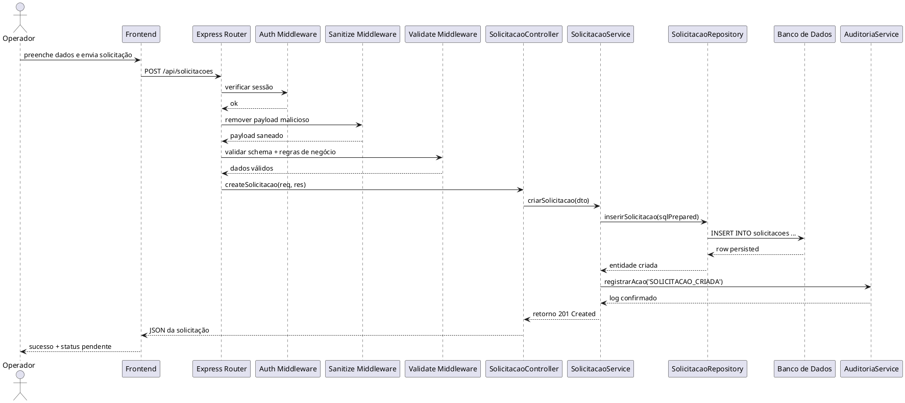
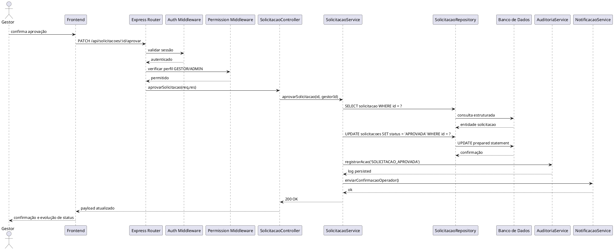
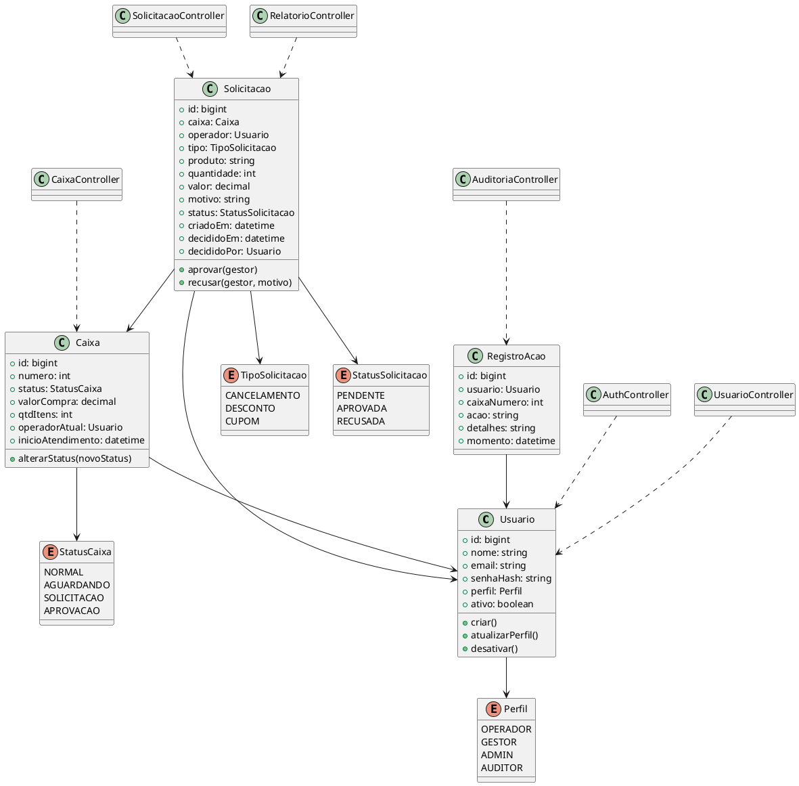

# Requisitos de Sistema — FilaLivre

## 1. Objetivo da Especificação Técnica

Este documento formaliza os requisitos internos do sistema FilaLivre sob a perspectiva técnica, cobrindo arquitetura de software, integração, segurança, contratos de API, persistência, regras de negócio e rastreabilidade. A estrutura segue os princípios da UML 2.5.1, da ISO/IEC/IEEE 29148:2018 e da taxonomia FURPS+ / ISO/IEC 25010.

O sistema é concebido como aplicação full-stack composta por:

- Frontend em HTML5 semântico, CSS3 e JavaScript Vanilla/ES6+
- Backend em Node.js com Express
- Banco de dados relacional, com suporte a SQLite em contexto local e PostgreSQL em ambiente de produção
- Prepared Statements para prevenção de SQL Injection
- Mecanismo de auditoria para todas as ações relevantes
- Camada de autenticação e autorização por perfil

---

## 2. Requisitos Funcionais de Sistema (RSF)

### RSF-01 — Autenticação de usuários
- Método: POST
- Rota: /api/auth/login
- Descrição: autentica usuário por e-mail e senha.
- Payload JSON:
```json
{
  "email": "gestor@empresa.com",
  "senha": "********"
}
```
- Validação:
  - e-mail obrigatório e formatado
  - senha mínima de 8 caracteres
  - usuário deve existir e estar ativo
- Resposta de sucesso:
  - 200 OK
  - token JWT / sessão
  - perfil, id e dados públicos do usuário
- Resposta de erro:
  - 401 Unauthorized para credenciais inválidas
  - 400 Bad Request para payload malformado

### RSF-02 — Logout de sessão
- Método: POST
- Rota: /api/auth/logout
- Descrição: invalidar sessão ou token informado.
- Middleware exigido:
  - authMiddleware
  - sessionInvalidationMiddleware
- Resposta:
  - 200 OK
  - 204 No Content em cenários sem corpo

### RSF-03 — Obter painel de caixas
- Método: GET
- Rota: /api/caixas
- Middleware:
  - authMiddleware
  - roleMiddleware('OPERADOR','GESTOR','ADMIN')
- Descrição: retorna listagem de caixas com status e indicadores de operação.
- Resposta:
  - 200 OK
  - array de objetos caixa com operador, tempo, valor e status.

### RSF-04 — Obter caixa por identificador
- Método: GET
- Rota: /api/caixas/:id
- Middleware:
  - authMiddleware
- Descrição: retorna detalhes do caixa, operador associado e situação operacional.
- Códigos:
  - 200 OK
  - 404 Not Found se inexistente

### RSF-05 — Criar solicitação de autorização
- Método: POST
- Rota: /api/solicitacoes
- Middleware:
  - authMiddleware
  - sanitizeRequestMiddleware
  - validateSolicitacaoSchema
- Payload JSON:
```json
{
  "caixaId": 3,
  "tipo": "CANCELAMENTO",
  "produto": "Arroz Tipo A",
  "quantidade": 2,
  "valor": 19.80,
  "motivo": "Produto com código divergente no caixa",
  "operadorId": 12
}
```
- Status codes:
  - 201 Created em sucesso
  - 400 Bad Request para validação falhada
  - 409 Conflict para regra de negócio violada
- Regras:
  - caixa deve existir e estar ativo
  - tipo deve estar em enum de tipos permitidos
  - operador deve ter permissão de registro
  - solicitação deve ficar pendente até decisão

### RSF-06 — Consultar solicitações do operador
- Método: GET
- Rota: /api/solicitacoes/minhas
- Middleware:
  - authMiddleware
- Descrição: lista solicitações relacionadas ao operador autenticado.
- Resposta:
  - 200 OK
  - lista paginada e filtrável

### RSF-07 — Consultar solicitações pendentes para gestão
- Método: GET
- Rota: /api/solicitacoes/pendentes
- Middleware:
  - authMiddleware
  - roleMiddleware('GESTOR','ADMIN')
- Descrição: retorna fila de solicitações com status pendente.
- Resposta:
  - 200 OK
  - array ordenado por data de criação

### RSF-08 — Aprovar solicitação
- Método: PATCH
- Rota: /api/solicitacoes/:id/aprovar
- Middleware:
  - authMiddleware
  - roleMiddleware('GESTOR','ADMIN')
  - ownershipOrPermissionMiddleware
- Payload JSON (opcional):
```json
{
  "observacao": "Autorizado conforme regra de aprovação do gestor"
}
```
- Resposta:
  - 200 OK
  - status atualizado para APROVADA
  - data/hora de decisão registrada

### RSF-09 — Recusar solicitação
- Método: PATCH
- Rota: /api/solicitacoes/:id/recusar
- Middleware:
  - authMiddleware
  - roleMiddleware('GESTOR','ADMIN')
- Payload JSON:
```json
{
  "motivoRecusa": "Desvio de regra de desconto e produto não cadastrado"
}
```
- Resposta:
  - 200 OK
  - status atualizado para RECUSADA
  - auditoria persistida

### RSF-10 — Histórico e relatórios
- Método: GET
- Rota: /api/relatorios/solicitacoes
- Middleware:
  - authMiddleware
  - roleMiddleware('GESTOR','ADMIN','AUDITOR')
- Query params:
  - caixaId
  - operadorId
  - tipo
  - dataInicio
  - dataFim
  - status
- Resposta:
  - 200 OK
  - dataset agregável para dashboard e exportação CSV/JSON

### RSF-11 — Cadastro de usuários
- Método: POST
- Rota: /api/usuarios
- Middleware:
  - authMiddleware
  - roleMiddleware('ADMIN')
  - validateUsuarioSchema
- Payload JSON:
```json
{
  "nome": "Maria de Souza",
  "email": "maria@empresa.com",
  "senha": "S3nh@Fort3",
  "perfil": "OPERADOR",
  "ativo": true
}
```
- Respostas:
  - 201 Created
  - 400 Bad Request
  - 409 Conflict em e-mail duplicado

### RSF-12 — Auditoria de ações
- Método: GET
- Rota: /api/auditoria
- Middleware:
  - authMiddleware
  - roleMiddleware('ADMIN','AUDITOR')
- Descrição: expõe trilha de ações de usuários e eventos de decisão.
- Resposta:
  - 200 OK
  - registros de auditoria com entidade, usuário, ação e timestamp.

---

## 3. Requisitos Não Funcionais (RNF) segundo FURPS+ / ISO/IEC 25010

### 3.1 Segurança
- S1: autenticação obrigatória em todas as rotas internas e administrativas
- S2: autorização por perfil e regra de permissão
- S3: senhas armazenadas com hash e salt (bcrypt/argon2)
- S4: uso de Prepared Statements em todas as consultas SQL
- S5: validação e sanitização de entrada em cada payload
- S6: proteção contra XSS e CSRF em ambiente web
- S7: expiração e rotação de sessão/token
- S8: log de acesso e ações sensíveis em trilha de auditoria

### 3.2 Performance
- P1: tempo de resposta medianas de UI em até 2 segundos para consultas simples
- P2: painel de caixas deve refletir dados em até 5 segundos após evento crítico
- P3: listagem de pendências com paginação e indexação por status/data
- P4: uso de consultas específicas por índice de desempenho
- P5: carregamento assíncrono em frontend para reduzir bloqueio da UI

### 3.3 Confiabilidade
- R1: todas as transações de criação/decisão devem ser atômicas
- R2: falha de banco deve retornar 503 Service Unavailable com mensagem consistente
- R3: auditoria não deve ser opcional; todo evento relevante deve gerar log
- R4: sistema deve manter integridade referencial entre caixas, usuários e solicitações
- R5: workflows de aprovação/recusa devem ser idempotentes por status

### 3.4 Usabilidade
- U1: interface deve ser operável em desktop e mobile com foco em leitura rápida
- U2: painel deve permitir visualização do status em menos de 3 cliques
- U3: mensagens de erro devem ser compreensíveis e orientadas à ação
- U4: ações críticas devem possuir confirmação visual e contexto de decisão

### 3.5 Arquitetura
- A1: separação em camadas: interface, API, regra de negócio, persistência, auditoria
- A2: desacoplamento de rotas, middlewares e serviços
- A3: fronteira clara entre entidades de domínio e DTOs de transporte
- A4: servidor Express com middlewares centralizados
- A5: banco relacional com esquema rígido e validações em modelo de dados

### 3.6 Compatibilidade e Portabilidade
- C1: suporte ao ambiente local com SQLite em desenvolvimento/teste
- C2: suporte ao PostgreSQL em produção e ambiente de integração
- C3: aplicação deve rodar em ambientes Linux/Unix com Node.js LTS

### 3.7 Manutenibilidade
- M1: cada controller deve ser responsável por um contexto funcional
- M2: regras de negócio devem estar em serviços e não em rotas
- M3: uso de enums e constantes para estados de caixa e solicitação
- M4: cobertura de testes unitários e integração para fluxos críticos

---

## 4. Diagramas de Sequência Dinâmicos de Backend (PlantUML)

### 4.1 Fluxo de criação de solicitação



### 4.2 Fluxo de aprovação por gestor



---

## 5. Diagrama Estrutural de Classes de Domínio e Controladores (PlantUML + OCL)



### 5.1 Invariantes OCL para transição de status

#### Invariante 1: status da solicitação
```ocl
context Solicitacao
inv statusValido:
  self.status = StatusSolicitacao::PENDENTE or
  self.status = StatusSolicitacao::APROVADA or
  self.status = StatusSolicitacao::RECUSADA
```

#### Invariante 2: aprovação exige gestor
```ocl
context Solicitacao
inv aprovacaoRequerGestor:
  self.status = StatusSolicitacao::APROVADA implies
  self.decididoPor <> null and self.decididoPor.perfil = Perfil::GESTOR
```

#### Invariante 3: recusa exige motivo
```ocl
context Solicitacao
inv recusaRequerMotivo:
  self.status = StatusSolicitacao::RECUSADA implies
  self.motivo <> null and self.motivo.trim().size() > 0
```

#### Invariante 4: caixa em operação
```ocl
context Caixa
inv caixaEmEstadoValido:
  self.status = StatusCaixa::NORMAL or
  self.status = StatusCaixa::AGUARDANDO or
  self.status = StatusCaixa::SOLICITACAO or
  self.status = StatusCaixa::APROVACAO
```

#### Invariante 5: evento de decisão
```ocl
context Solicitacao
inv decisaoCompatível:
  self.decididoEm <> null implies self.status <> StatusSolicitacao::PENDENTE
```

---

## 6. Dicionário Técnico de Dados e Esquema Físico (DDL)

### 6.1 Tabela usuarios
```sql
CREATE TABLE usuarios (
  id BIGSERIAL PRIMARY KEY,
  nome VARCHAR(120) NOT NULL,
  email VARCHAR(180) NOT NULL UNIQUE,
  senha VARCHAR(255) NOT NULL,
  perfil VARCHAR(30) NOT NULL CHECK (perfil IN ('OPERADOR','GESTOR','ADMIN','AUDITOR')),
  ativo BOOLEAN NOT NULL DEFAULT TRUE,
  criado_em TIMESTAMP NOT NULL DEFAULT CURRENT_TIMESTAMP,
  atualizado_em TIMESTAMP NULL
);

CREATE INDEX idx_usuarios_email ON usuarios(email);
CREATE INDEX idx_usuarios_perfil ON usuarios(perfil);
```

### 6.2 Tabela caixas
```sql
CREATE TABLE caixas (
  id BIGSERIAL PRIMARY KEY,
  numero INTEGER NOT NULL UNIQUE,
  status VARCHAR(30) NOT NULL CHECK (status IN ('NORMAL','AGUARDANDO','SOLICITACAO','APROVACAO')),
  valor_compra DECIMAL(12,2) NOT NULL DEFAULT 0,
  qtd_itens INTEGER NOT NULL DEFAULT 0,
  operador_id BIGINT NULL,
  inicio_atendimento TIMESTAMP NULL,
  CONSTRAINT fk_caixas_operador FOREIGN KEY (operador_id) REFERENCES usuarios(id),
  CONSTRAINT chk_caixas_qtd_itens CHECK (qtd_itens >= 0),
  CONSTRAINT chk_caixas_valor CHECK (valor_compra >= 0)
);

CREATE INDEX idx_caixas_status ON caixas(status);
CREATE INDEX idx_caixas_operador ON caixas(operador_id);
```

### 6.3 Tabela solicitacoes
```sql
CREATE TABLE solicitacoes (
  id BIGSERIAL PRIMARY KEY,
  caixa_id BIGINT NOT NULL,
  operador_id BIGINT NOT NULL,
  tipo VARCHAR(30) NOT NULL CHECK (tipo IN ('CANCELAMENTO','DESCONTO','CUPOM')),
  produto VARCHAR(160) NOT NULL,
  quantidade INTEGER NULL,
  valor DECIMAL(12,2) NULL,
  motivo TEXT NOT NULL,
  status VARCHAR(30) NOT NULL DEFAULT 'PENDENTE' CHECK (status IN ('PENDENTE','APROVADA','RECUSADA')),
  criado_em TIMESTAMP NOT NULL DEFAULT CURRENT_TIMESTAMP,
  decidido_em TIMESTAMP NULL,
  decidido_por BIGINT NULL,
  motivo_recusa TEXT NULL,
  CONSTRAINT fk_solicitacoes_caixa FOREIGN KEY (caixa_id) REFERENCES caixas(id),
  CONSTRAINT fk_solicitacoes_operador FOREIGN KEY (operador_id) REFERENCES usuarios(id),
  CONSTRAINT fk_solicitacoes_decisor FOREIGN KEY (decidido_por) REFERENCES usuarios(id),
  CONSTRAINT chk_solicitacoes_quantidade CHECK (quantidade IS NULL OR quantidade > 0),
  CONSTRAINT chk_solicitacoes_valor CHECK (valor IS NULL OR valor >= 0)
);

CREATE INDEX idx_solicitacoes_status_data ON solicitacoes(status, criado_em DESC);
CREATE INDEX idx_solicitacoes_caixa ON solicitacoes(caixa_id);
CREATE INDEX idx_solicitacoes_operador ON solicitacoes(operador_id);
```

### 6.4 Tabela registros_acao
```sql
CREATE TABLE registros_acao (
  id BIGSERIAL PRIMARY KEY,
  usuario_id BIGINT NOT NULL,
  caixa_numero INTEGER NULL,
  acao VARCHAR(60) NOT NULL,
  detalhes TEXT,
  momento TIMESTAMP NOT NULL DEFAULT CURRENT_TIMESTAMP,
  CONSTRAINT fk_registros_usuario FOREIGN KEY (usuario_id) REFERENCES usuarios(id)
);

CREATE INDEX idx_registros_usuario ON registros_acao(usuario_id);
CREATE INDEX idx_registros_momento ON registros_acao(momento DESC);
```

### 6.5 Dicionário de dados

| Entidade | Campo | Tipo | Obrigatório | Restrições | Descrição |
|---|---|---|---|---|---|
| usuarios | id | BIGINT | Sim | PK | Código do usuário |
| usuarios | nome | VARCHAR(120) | Sim | NOT NULL | Nome completo |
| usuarios | email | VARCHAR(180) | Sim | UNIQUE | E-mail de login |
| usuarios | senha | VARCHAR(255) | Sim | NOT NULL | Hash da senha |
| usuarios | perfil | VARCHAR(30) | Sim | CHECK | Papel no sistema |
| caixas | numero | INTEGER | Sim | UNIQUE | Número físico do caixa |
| caixas | status | VARCHAR(30) | Sim | CHECK | Estado operacional |
| solicitacoes | tipo | VARCHAR(30) | Sim | CHECK | Tipo da solicitação |
| solicitacoes | status | VARCHAR(30) | Sim | CHECK | Situação da solicitação |
| solicitacoes | motivo | TEXT | Sim | NOT NULL | Motivo da solicitação |
| registros_acao | acao | VARCHAR(60) | Sim | NOT NULL | Ação executada |

---

## 7. Contratos de API RESTful

### 7.1 Rotas públicas

| Método | Rota | Autenticação | Descrição | Status esperado |
|---|---|---|---|---|
| POST | /api/auth/login | Não | autenticação | 200 / 401 |
| POST | /api/auth/logout | Sim | invalida sessão | 200 / 204 |

### 7.2 Rotas protegidas por perfil

| Método | Rota | Perfil | Descrição | Status esperado |
|---|---|---|---|---|
| GET | /api/caixas | OPERADOR/GESTOR/ADMIN | lista caixas | 200 |
| GET | /api/caixas/:id | QUALQUER AUTENTICADO | detalhes da caixa | 200 / 404 |
| POST | /api/solicitacoes | OPERADOR | cria solicitação | 201 / 400 / 409 |
| GET | /api/solicitacoes/minhas | OPERADOR | solicitações do operador | 200 |
| GET | /api/solicitacoes/pendentes | GESTOR/ADMIN | fila de pendências | 200 |
| PATCH | /api/solicitacoes/:id/aprovar | GESTOR/ADMIN | aprova solicitação | 200 |
| PATCH | /api/solicitacoes/:id/recusar | GESTOR/ADMIN | recusa solicitação | 200 |
| GET | /api/relatorios/solicitacoes | GESTOR/ADMIN/AUDITOR | relatório | 200 |
| POST | /api/usuarios | ADMIN | cadastro de usuário | 201 / 409 |
| GET | /api/auditoria | ADMIN/AUDITOR | trilha de auditoria | 200 |

### 7.3 Estrutura de resposta JSON padrão

```json
{
  "sucesso": true,
  "dados": {},
  "mensagem": "Operação concluída com sucesso",
  "timestamp": "2026-09-01T12:30:00Z"
}
```

Erro padrão:

```json
{
  "sucesso": false,
  "erro": "Dados inválidos para criação da solicitação",
  "codigo": "VALIDATION_ERROR",
  "timestamp": "2026-09-01T12:30:00Z"
}
```

---

## 8. Matriz Bidirecional de Rastreabilidade Técnica

| Requisito de Usuário | Caso de Uso | Requisito de Sistema | Rota/Componente | Persistência |
|---|---|---|---|---|
| RU-01 | UC01 | RSF-01 | /api/auth/login | usuarios |
| RU-02 | UC02 | RSF-03 | /api/caixas | caixas |
| RU-03 | UC03 | RSF-05 | /api/solicitacoes | solicitacoes |
| RU-04 | UC04 | RSF-06 / RSF-07 | /api/solicitacoes/* | solicitacoes |
| RU-05 | UC05 | RSF-07 + NotificacaoService | /api/solicitacoes/pendentes | solicitacoes |
| RU-06 | UC06 | RSF-08 | /api/solicitacoes/:id/aprovar | solicitacoes + registros_acao |
| RU-07 | UC07 | RSF-09 | /api/solicitacoes/:id/recusar | solicitacoes + registros_acao |
| RU-08 | UC08 | RSF-10 | /api/relatorios/solicitacoes | solicitacoes |
| RU-09 | UC09 | RSF-11 | /api/usuarios | usuarios |

---

## 9. Observações de implementação e segurança

1. Middleware de autenticação deve verificar sessão ou token e atualizar metadata da requisição.
2. Sanitização deve ser aplicada antes do processamento de dados sensíveis.
3. Todos os comandos SQL devem usar Prepared Statements para proteger contra SQL Injection.
4. Validações de regra de negócio devem ocorrer no serviço e não apenas na rota.
5. Auditoria deve registrar userId, ação, detalhes, caixa e timestamp em todas as transações relevantes.
6. Os status de caixa e solicitação devem seguir enumerações explícitas para evitar inconsistência de domínio.

---

## 10. Conclusão

Os requisitos de sistema descritos neste documento transformam os requisitos de usuário em especificações técnicas operáveis, com contratos de API, regras de integridade, camada de persistência, segurança e rastreabilidade. A solução exige rigor em autenticação, validação, auditoria e modelagem de dados para garantir que o fluxo decisório entre operador e gestor seja confiável, rápido e auditável em ambiente de operação comercial real.
