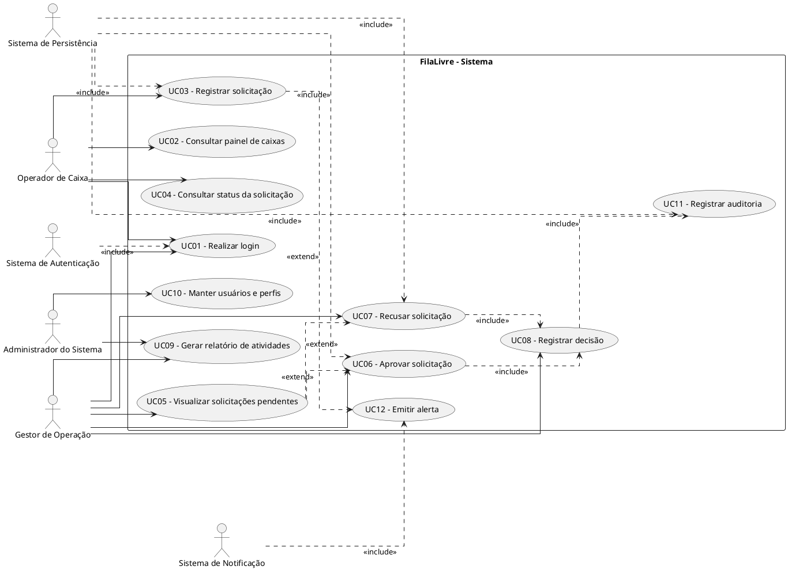
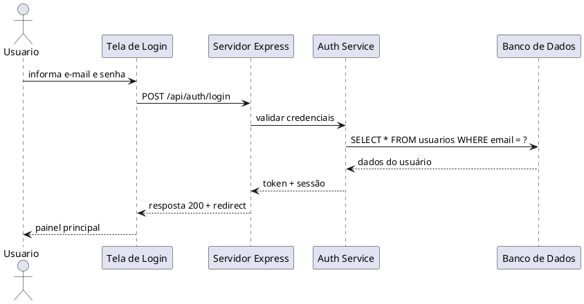
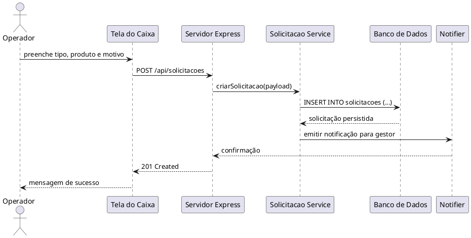
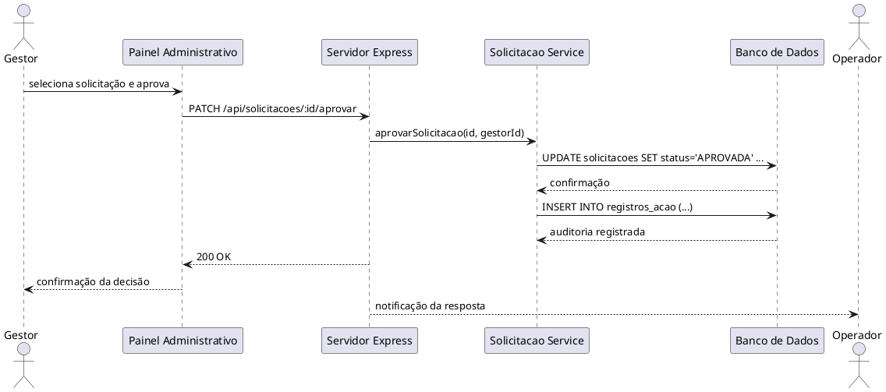

# Requisitos de Usuário — FilaLivre

## 1. Visão Geral

Este documento formaliza os requisitos de usuário da solução FilaLivre sob a perspectiva de negócio, experiência do usuário e critérios externos de uso. A abordagem segue a UML 2.5.1, a ISO/IEC/IEEE 29148:2018 e a visão orientada a valor do usuário, com foco em operação remota de caixas, gestão de solicitações e autonomia operacional do gestor.

O sistema permite que operadores de caixa registrem ocorrências que exigem autorização, e que gestores analisem, decidam e acompanhem essas solicitações sem deslocamento físico até o terminal. O produto é concebido para reduzir perdas operacionais, melhorar a experiência do cliente, reduzir filas e aumentar a visibilidade do processo de autorização.

---

## 2. Identificação e Caracterização dos Atores do Sistema

### 2.1 Definição de Ator conforme UML 2.5.1

Na UML 2.5.1, um ator representa um papel desempenhado por um usuário, sistema externo, dispositivo ou entidade organizacional que interage com o sistema e cujo comportamento é relevante para a especificação do comportamento funcional.

### 2.2 Atores Humanos Primários

#### Ator 1: Operador de Caixa
- Tipo: Humano primário
- Papel: atende clientes em entrepostos físicos de venda, registra eventos e solicita autorização para ações restritas.
- Objetivos:
  - manter o fluxo de atendimento;
  - registrar solicitações com precisão;
  - acompanhar o status da decisão;
  - continuar atendimento após aprovação.
- Interações principais:
  - login no terminal do caixa;
  - registro de solicitações;
  - consulta do status de aprovação;
  - visualização de histórico de ações.

#### Ator 2: Gestor de Operação / Supervisor
- Tipo: Humano primário
- Papel: supervisa a operação dos caixas, analisa solicitações e decide autonomamente sobre aprovação ou recusa.
- Objetivos:
  - reagir rapidamente a eventos críticos;
  - controlar a operação em tempo real;
  - reduzir tempo de espera do cliente;
  - manter auditoria das decisões.
- Interações principais:
  - login em painel administrativo;
  - visualização de caixa em situação de atenção;
  - aprovação/recusa de solicitações;
  - geração de relatórios e acompanhamento histórico.

#### Ator 3: Administrador do Sistema
- Tipo: Humano primário
- Papel: administra usuários, perfis, permissões e configurações gerais do sistema.
- Objetivos:
  - manter segurança e conformidade;
  - cadastrar perfis e usuários;
  - monitorar eventos críticos;
  - manter operação sustentável.

### 2.3 Atores Humanos Secundários

#### Ator 4: Cliente/Consumidor
- Tipo: Humano secundário
- Papel: é impactado pela qualidade do atendimento e pela rapidez da resolução.
- Objetivos:
  - concluir compra sem atrasos indevidos;
  - receber respostas rápidas em situações atípicas.
- Interações principais:
  - espera do atendente;
  - recebimento de retorno da operação sinalizada.

#### Ator 5: Equipe de Atendimento
- Tipo: Humano secundário
- Papel: auxilia ou complementa o processo de operação em loja.
- Objetivos:
  - reduzir interdependência física entre áreas;
  - facilitar apoio e coordenação.

### 2.4 Atores Sistêmicos

#### Ator 6: Sistema de Autenticação e Autorização
- Tipo: sistêmico
- Papel: valida credenciais, gera sessão, aplica regras de autorização e perfis.
- Requisitos de interação:
  - autenticação de usuários;
  - manutenção do contexto de sessão;
  - restrição de acesso por perfil.

#### Ator 7: Sistema de Persistência de Dados
- Tipo: sistêmico
- Papel: armazena usuários, caixas, solicitações, decisões, eventos e históricos.
- Requisitos de interação:
  - escrita transacional;
  - recuperação consistente;
  - integridade referencial.

#### Ator 8: Sistema de notificação/alerta
- Tipo: sistêmico
- Papel: notifica o gestor sobre novas solicitações e mudanças de estado.
- Interações principais:
  - envio de notificação por evento;
  - atualização do painel em tempo real ou quase real.

---

## 3. Diagrama de Casos de Uso (UML 2.5.1)



### Comentário do Diagrama
- O sistema é delimitado por uma fronteira clara e os atores externos interagem por papéis bem definidos.
- O processo de criação de solicitação estende a emissão de alerta para notificar o gestor.
- A decisão do gestor inclui o registro de auditoria e a persistência das alterações no banco.

---

## 4. Catálogo de Requisitos de Usuário (RU)

### 4.1 Estrutura de Identificação
- RU-01: Autenticação do Usuário
- RU-02: Acesso ao Painel de Caixas
- RU-03: Registro de Solicitação de Autorização
- RU-04: Consulta de Status da Solicitação
- RU-05: Visualização de Solicitações Pendentes
- RU-06: Aprovação da Solicitação
- RU-07: Recusa da Solicitação
- RU-08: Geração de Relatórios Operacionais
- RU-09: Manutenção de Usuários e Perfis
- RU-10: Registro de Auditoria de Decisões

### 4.2 Catálogo Detalhado

| Identificador | Caso de Uso | Ator Principal | Prioridade | Descrição resumida |
|---|---|---|---|---|
| RU-01 | UC01 | Operador / Gestor / Admin | Must Have | Login seguro com autenticação e sessão. |
| RU-02 | UC02 | Operador / Gestor | Must Have | Visualização do painel com status dos caixas. |
| RU-03 | UC03 | Operador | Must Have | Criação de solicitação para autorização. |
| RU-04 | UC04 | Operador | Should Have | Consulta do status em tempo útil. |
| RU-05 | UC05 | Gestor | Must Have | Listagem de solicitações pendentes. |
| RU-06 | UC06 | Gestor | Must Have | Aprovação da solicitação. |
| RU-07 | UC07 | Gestor | Must Have | Recusa da solicitação. |
| RU-08 | UC09 | Gestor / Admin | Should Have | Relatórios e acompanhamento. |
| RU-09 | UC10 | Admin | Must Have | Criação e manutenção de usuários/perfis. |
| RU-10 | UC11 | Sistema | Must Have | Auditoria de decisões e ações. |

### 4.3 Descrições por Requisito

#### RU-01 — Realizar Login
- Caso de Uso associado: UC01
- Ator principal: Operador, Gestor, Administrador
- Prioridade: Must Have
- Pré-condições:
  - usuário cadastrado;
  - e-mail e senha válidos;
  - perfil associado ao sistema.
- Fluxo operacional:
  1. Usuário acessa tela de login.
  2. Informa e-mail e senha.
  3. Sistema valida credenciais.
  4. Sistema cria sessão e redireciona para painel apropriado.
- Pós-condições:
  - sessão iniciada;
  - usuário acessa área conforme perfil;
  - evento de autenticação registrado.

#### RU-02 — Consultar Painel de Caixas
- Caso de Uso associado: UC02
- Ator principal: Operador / Gestor
- Prioridade: Must Have
- Pré-condições: usuário autenticado.
- Fluxo operacional:
  1. Usuário acessa painel principal.
  2. Sistema recarrega status dos caixas.
  3. Sistema apresenta caixas, operador, produto e tempo de atendimento.
  4. Usuário seleciona caixa para detalhamento.
- Pós-condições:
  - contexto operacional atualizado;
  - usuário visualiza informações relevantes.

#### RU-03 — Registrar Solicitação de Autorização
- Caso de Uso associado: UC03
- Ator principal: Operador
- Prioridade: Must Have
- Pré-condições:
  - caixa ativo;
  - usuário autenticado;
  - ocorrência de autorização necessária.
- Fluxo operacional:
  1. Operador seleciona caixa.
  2. Informa tipo da solicitação (cancelamento, desconto, cupom, outra ação).
  3. Preenche produto, quantidade, valor e motivo.
  4. Sistema valida campos obrigatórios.
  5. Sistema registra a solicitação com status pendente.
  6. Sistema dispara notificação ao gestor.
- Pós-condições:
  - solicitação persistida;
  - caixa passa para estado de atenção;
  - evento de auditoria criado.

#### RU-04 — Consultar Status da Solicitação
- Caso de Uso associado: UC04
- Ator principal: Operador
- Prioridade: Should Have
- Pré-condições: solicitação registrada ou consultada.
- Fluxo operacional:
  1. Operador acessa histórico de solicitações.
  2. Sistema filtra por caixa e usuário.
  3. Sistema exibe status, decisão, motivo e timestamps.
- Pós-condições:
  - usuário recebe atualização do resultado.

#### RU-05 — Visualizar Solicitações Pendentes
- Caso de Uso associado: UC05
- Ator principal: Gestor
- Prioridade: Must Have
- Pré-condições: gestor autenticado.
- Fluxo operacional:
  1. Gestor acessa central de solicitações.
  2. Sistema lista pendências por ordem de antiguidade.
  3. Sistema exibe dados do caixa, operador e operação demandada.
- Pós-condições:
  - gestor possui visão da fila de tratamento.

#### RU-06 — Aprovar Solicitação
- Caso de Uso associado: UC06
- Ator principal: Gestor
- Prioridade: Must Have
- Pré-condições:
  - solicitação existente;
  - status pendente;
  - gestor com autorização.
- Fluxo operacional:
  1. Gestor seleciona solicitação.
  2. Sistema apresenta detalhamento completo.
  3. Gestor confirma aprovação.
  4. Sistema atualiza status para aprovada.
  5. Sistema registra decisão e notifica operador.
- Pós-condições:
  - atendimento pode prosseguir;
  - evento de decisão persistido.

#### RU-07 — Recusar Solicitação
- Caso de Uso associado: UC07
- Ator principal: Gestor
- Prioridade: Must Have
- Pré-condições:
  - solicitação pendente;
  - justificativa opcional registrada.
- Fluxo operacional:
  1. Gestor seleciona solicitação.
  2. Informa justificativa ou motivo.
  3. Confirma recusa.
  4. Sistema grava decisão.
- Pós-condições:
  - solicitação marcada como recusada;
  - operador recebe feedback;
  - ação de auditoria registrada.

#### RU-08 — Gerar Relatórios Operacionais
- Caso de Uso associado: UC09
- Ator principal: Gestor / Admin
- Prioridade: Should Have
- Pré-condições: usuário autenticado e com permissão.
- Fluxo operacional:
  1. Usuário escolhe período e filtro.
  2. Sistema consulta solicitações e caixas.
  3. Sistema gera relatório consolidado.
- Pós-condições:
  - relatório disponível para exportação ou visualização.

#### RU-09 — Manter Usuários e Perfis
- Caso de Uso associado: UC10
- Ator principal: Admin
- Prioridade: Must Have
- Pré-condições: administrador autenticado.
- Fluxo operacional:
  1. Admin acessa painel de usuários.
  2. Cadastra ou edita usuário.
  3. Define perfil: operador, gestor, admin.
  4. Sistema valida dados e persiste.
- Pós-condições:
  - usuário ativo e atribuído corretamente ao perfil.

#### RU-10 — Registrar Auditoria de Decisões
- Caso de Uso associado: UC11
- Ator principal: Sistema
- Prioridade: Must Have
- Pré-condições: qualquer decisão relevante ocorrida.
- Fluxo operacional:
  1. Sistema captura ação, usuário, caixa e momento.
  2. Armazena registro de auditoria.
- Pós-condições:
  - traçabilidade completa da operação.

---

## 5. Histórias de Usuário e Critérios de Aceite em BDD / Gherkin

### US-01 — Login do Usuário
- História: Como operador, quero realizar login para acessar o sistema de forma segura.
- Critérios de Aceite:
```gherkin
Dado que o usuário acessou a tela de login
E informa um e-mail e senha válidos
Quando confirma a autenticação
Então o sistema deve criar a sessão e redirecionar para o painel correspondente
E registrar o evento de login na auditoria
```

### US-02 — Painel de Caixas
- História: Como gestor, quero ver o estado dos caixas para tomar decisões rápidas.
```gherkin
Dado que o gestor está autenticado
Quando o painel principal é carregado
Então o sistema deve exibir todos os caixas com status, operador e tempo de atendimento
E atualizar os dados em intervalos regulares
```

### US-03 — Registro de Solicitação
- História: Como operador, quero registrar uma solicitação para ser analisada por um gestor.
```gherkin
Dado que o operador está autenticado no caixa
E seleciona um caixa em atendimento
Quando preenche tipo, valor, produto, quantidade e motivo
E confirma a solicitação
Então o sistema deve persistir a requisição com status pendente
E notificar o gestor
```

### US-04 — Consulta de Status
- História: Como operador, quero consultar o status da solicitação para saber se ela foi aprovada.
```gherkin
Dado que existe uma solicitação registrada
Quando o operador acessa o histórico
Então o sistema deve apresentar status, decisão e data da resposta
```

### US-05 — Aprovação
- História: Como gestor, quero aprovar uma solicitação para liberar a continuidade do atendimento.
```gherkin
Dado que é uma solicitação pendente
E o gestor possui autorização
Quando confirma a aprovação
Então o sistema deve mudar o status para aprovada
E notificar o operador
```

### US-06 — Recusa
- História: Como gestor, quero recusar uma solicitação para registrar a decisão e impedir continuidade indevida.
```gherkin
Dado que existe uma solicitação pendente
Quando o gestor informa a recusa e justificativa
Então o sistema deve registrar a recusa
E bloquear a continuidade da ação solicitada
```

### US-07 — Relatório
- História: Como gestor, quero gerar relatórios para acompanhar indicadores e falhas operacionais.
```gherkin
Dado que o gestor selecionou período e filtros
Quando executa a geração de relatório
Então o sistema deve consolidar dados de caixa, usuário e solicitações
E disponibilizar o resultado em tela ou exportação
```

### US-08 — Auditoria
- História: Como administrador, quero manter rastreabilidade de todas as decisões para atender requisitos de compliance e segurança.
```gherkin
Dado que houve qualquer alteração relevante
Quando a ação é executada
Então o sistema deve registrar usuário, caixa, ação e timestamp
E manter a linha do tempo da operação
```

---

## 6. Diagramas de Sequência com Foco no Usuário

### 6.1 Sequência: Login e Acesso ao Painel



### 6.2 Sequência: Criação de Solicitação



### 6.3 Sequência: Aprovação do Gestor



---

## 7. Regras de Negócio Relevantes para o Usuário

- Somente usuários autenticados podem utilizar as rotas de negócio.
- Gestores têm privilégio de aprovação e recusa.
- Operadores não podem aprovar ou recusar próprias solicitações.
- Solicitações só podem mudar de pendente para aprovado ou recusado em estados válidos.
- Toda decisão deve gerar evento de auditoria.
- Caixas só devem receber nova solicitação quando o estado não bloquear operações críticas.
- Decisão e data da aprovação devem ser registradas em timestamp confiável.

---

## 8. Critérios externos de qualidade percebidos pelo usuário

- Tempo de resposta do sistema em cenários normais: inferior a 2 segundos para listagens e em torno de 3 segundos para processamento de solicitações.
- Interface clara e com feedback visual após ações críticas.
- Transparência do processo: o operador vê o status e o motivo da decisão.
- Segurança: apenas perfis autorizados acessam áreas específicas.
- Robustez: nenhuma operação crítica deve ficar sem auditoria.

---

## 9. Conclusão

Os requisitos de usuário evidenciam a necessidade de um sistema com alta visibilidade operacional, baixa fricção para operadores e resposta ágil de gestores. A visão de negócio enfatiza reduções de tempo físico e aumento da eficiência operacional, sem perder segurança, transparência e rastreabilidade.
