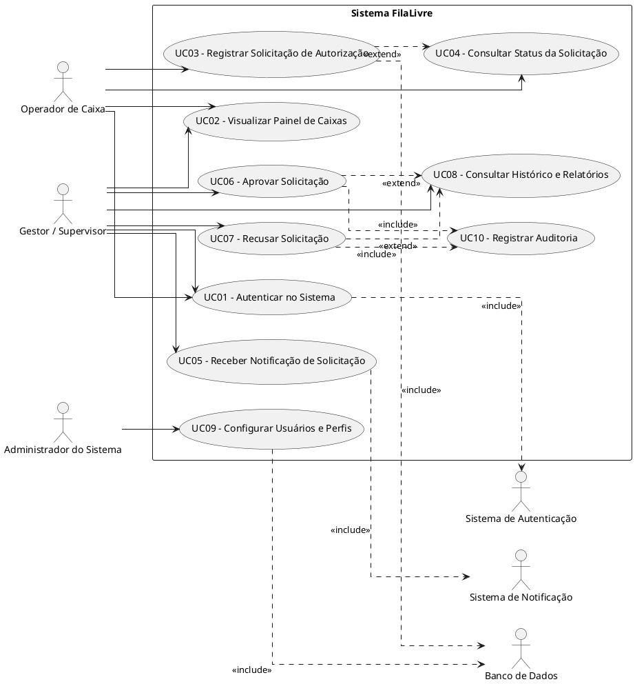
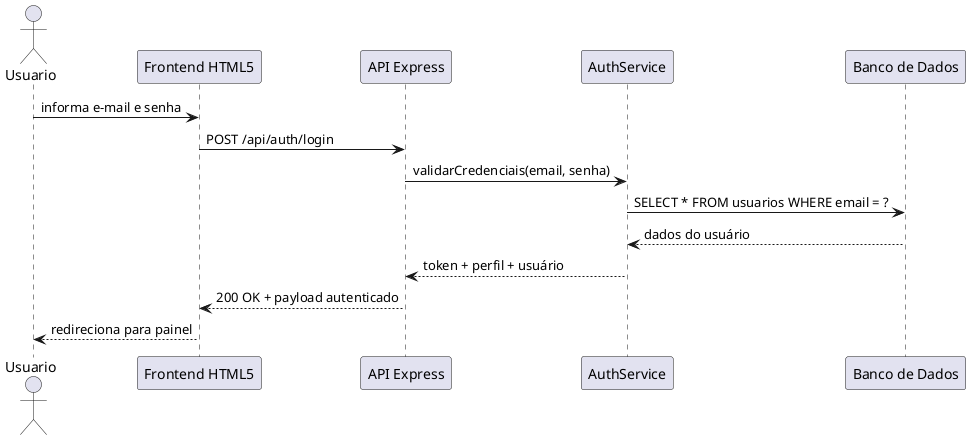
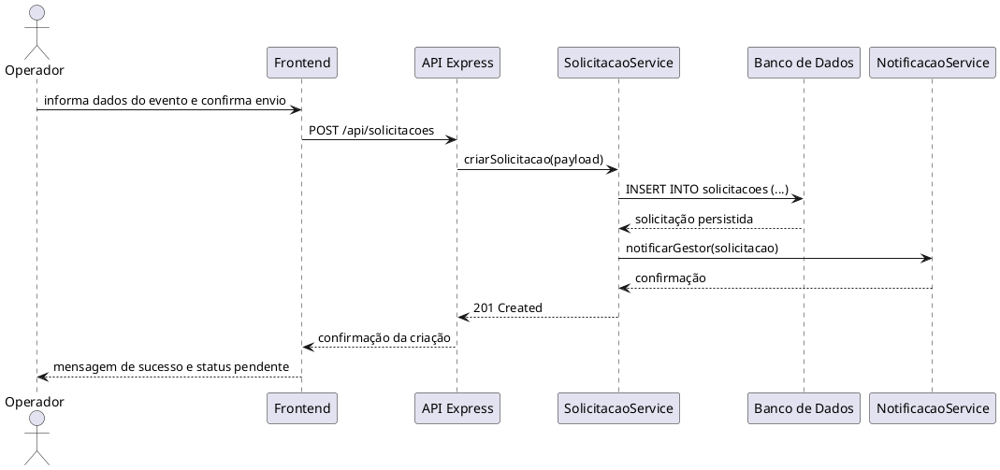
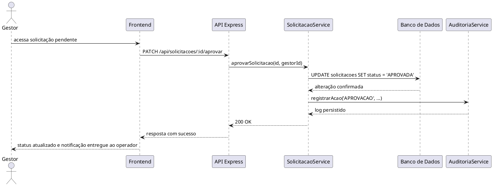

# Requisitos de Usuário — FilaLivre

## 1. Visão Geral e Contexto de Negócio

O sistema FilaLivre é uma solução de apoio operacional para supermercados e redes varejistas que operam múltiplos pontos de atendimento. Seu propósito é reduzir o tempo de espera e a interrupção da operação em frente de caixa ao permitir que o gestor ou supervisor valide solicitações de autorização de forma remota, sem deslocamento físico ao terminal de caixa.

O contexto de uso envolve três dimensões principais:

- Operador de caixa: realiza o atendimento ao cliente e dispara a solicitação quando a rotina exige aprovação.
- Gestor/supervisor: recebe a solicitação, analisa o contexto apresentado e decide aprovar ou recusar.
- Sistema de apoio: centraliza registros, validações, auditoria e persistência, oferecendo visibilidade operacional e rastreabilidade.

A solução é orientada à experiência do usuário em ambiente mobile-first, com interface web responsiva em HTML5 semântico, CSS3 e JavaScript ES6+, e com regras de negócio estruturadas para a operação comercial do varejo.

---

## 2. Identificação e Caracterização Formal dos Atores (UML 2.5.1)

### 2.1 Atores Humanos Primários

#### Ator: Operador de Caixa
- Tipo: Humano
- Papel: realiza atendimentos, identifica situações de necessidade de autorização e submete solicitações ao gestor.
- Responsabilidades:
  - iniciar atendimento de cliente;
  - identificar situações que exigem validação;
  - registrar solicitação com dados do caixa, produto, valor, quantidade e motivo;
  - acompanhar o status da solicitação;
  - receber aprovação ou recusa;
  - continuar atendimento conforme decisão.
- Características:
  - exige agilidade e baixa fricção; 
  - opera em terminal de caixa com alta carga de contexto visual; 
  - precisa de interface simples, clara e com poucos passos.

#### Ator: Gestor / Supervisor
- Tipo: Humano
- Papel: acompanha o painel de operação, decide sobre solicitações e acompanha a situação do caixa.
- Responsabilidades:
  - visualizar fila de solicitações pendentes;
  - analisar dados detalhados de cada ocorrência;
  - aprovar ou recusar a ação;
  - monitorar caixas ativos e status operacional;
  - revisar histórico e auditoria.
- Características:
  - trabalha em cenário de decisão em tempo real;
  - depende de informações contextualizadas e consistentes; 
  - exige visão consolidada por caixa, por operador e por tempo.

### 2.2 Atores Humanos Secundários

#### Ator: Administrador do Sistema
- Tipo: Humano
- Papel: configura perfis, usuários, permissões e parâmetros operacionais do sistema.
- Responsabilidades:
  - cadastrar e ativar usuários;
  - atribuir perfis e papéis;
  - configurar estados iniciais e regras de negócio;
  - consultar logs e evidências de auditoria.
- Características:
  - não participa do fluxo operacional diário;
  - atua em administração, segurança e governança.

#### Ator: Auditor / Compliance
- Tipo: Humano
- Papel: revisa registros de ocorrências, decisões, alterações e ações de usuários.
- Responsabilidades:
  - examinar rastros de auditoria;
  - confirmar conformidade com políticas;
  - auxiliar em investigações internas.
- Características:
  - leitura analítica, sem necessidade de operação direta.

### 2.3 Atores Sistêmicos

#### Ator: Sistema de Autenticação
- Tipo: Sistêmico
- Papel: valida credenciais e emite tokens ou sessões para usuários autenticados.
- Interações:
  - autentica operador, gestor e administrador;
  - rejeita acesso sem autorização;
  - controla expiração de sessão e validade de token.

#### Ator: Banco de Dados Relacional
- Tipo: Sistêmico
- Papel: persiste usuários, caixas, solicitações, decisões, auditoria e métricas.
- Interações:
  - registra dados transacionais;
  - garante integridade referencial;
  - fornece consulta de histórico e relatórios.

#### Ator: Sistema de Notificação
- Tipo: Sistêmico
- Papel: notifica o gestor sobre eventos relevantes e evolução do fluxo.
- Interações:
  - dispara notificação ao receber nova solicitação;
  - sinaliza mudança de status;
  - pode operar em canal push, websocket ou polling.

#### Ator: Serviço de Auditoria
- Tipo: Sistêmico
- Papel: grava trilha de eventos e alterações de estado para suporte a governança e fiscalização.
- Interações:
  - registro de criação, decisão, recusa, autenticação e revisão.

---

## 3. Diagrama de Casos de Uso (PlantUML)



### 3.1 Observações sobre a fronteira do sistema

A fronteira do sistema inclui a interface web do usuário, regras de negócios do serviço, persistência, notificação e trilha de auditoria. Os atores externos entram em contato com o sistema por autenticação, operações de caixa e monitoramento de status operacional.

---

## 4. Catálogo Detalhado de Requisitos de Usuário (RU)

### RU-01 — Autenticação no Sistema
- Caso de Uso associado: UC01
- Ator principal: Operador de Caixa / Gestor / Administrador
- Prioridade: Must Have
- Pré-condições:
  - usuário possui credencial válida;
  - sistema acessível na URL do ambiente;
  - perfil e senha informados corretamente.
- Fluxo operacional:
  1. Usuário informa e-mail e senha.
  2. Sistema valida entrada e aplica regras de sanitização.
  3. Sistema consulta usuário ativo no banco.
  4. Sistema compara hash da senha e valida perfil.
  5. Sistema cria sessão e redireciona para painel adequado.
- Pós-condições:
  - usuário autenticado com sessão ativa;
  - perfil direciona corretamente para página funcional.

### RU-02 — Visualização do Painel de Caixas
- Caso de Uso associado: UC02
- Ator principal: Operador / Gestor
- Prioridade: Must Have
- Pré-condições:
  - usuário autenticado;
  - pelo menos um caixa cadastrado.
- Fluxo operacional:
  1. Usuário acessa painel de operações.
  2. Sistema carrega caixa por status, operador, valor e tempo de atendimento.
  3. Sistema ordena solicitações pendentes e exibe informações críticas.
  4. Usuário analisa o estado da operação.
- Pós-condições:
  - o usuário obtém visão operacional e contextual da fila de trabalho.

### RU-03 — Registro de Solicitação de Autorização
- Caso de Uso associado: UC03
- Ator principal: Operador de Caixa
- Prioridade: Must Have
- Pré-condições:
  - operador autenticado;
  - caixa associado ao operador está ativo;
  - ocorrência exige validação.
- Fluxo operacional:
  1. Operador identifica necessidade de autorização.
  2. Sistema solicita dados do evento: caixa, produto, quantidade, valor, motivo.
  3. Operador informa os dados e confirma envio.
  4. Sistema valida campos obrigatórios e regras de negócio.
  5. Sistema cria solicitação com status pendente.
  6. Sistema registra auditoria e notifica gestor.
- Pós-condições:
  - solicitação persistida com status pendente;
  - gestor recebe notificação e pode decidir.

### RU-04 — Consulta de Status da Solicitação
- Caso de Uso associado: UC04
- Ator principal: Operador de Caixa / Gestor
- Prioridade: Should Have
- Pré-condições:
  - usuário autenticado;
  - solicitação existente.
- Fluxo operacional:
  1. Usuário acessa histórico ou painel de solicitações.
  2. Sistema consulta status atual.
  3. Sistema retorna status, tempo de espera, última ação e responsável pela decisão.
- Pós-condições:
  - usuário conhece o estado da solicitação sem intervenção manual.

### RU-05 — Recebimento de Notificação de Solicitação
- Caso de Uso associado: UC05
- Ator principal: Gestor / Supervisor
- Prioridade: Must Have
- Pré-condições:
  - gestor autenticado;
  - solicitação criada e pendente;
  - canal de notificação habilitado.
- Fluxo operacional:
  1. Sistema identifica nova solicitação pendente.
  2. Sistema dispara notificação ao gestor.
  3. Gestor acessa a área de pendências.
  4. Sistema exibe a solicitação junto ao contexto do caixa.
- Pós-condições:
  - gestor recebe alerta e toma decisão em tempo útil.

### RU-06 — Aprovação de Solicitação
- Caso de Uso associado: UC06
- Ator principal: Gestor / Supervisor
- Prioridade: Must Have
- Pré-condições:
  - gestor autenticado;
  - solicitação existente e pendente;
  - demais regras de autorização atendidas.
- Fluxo operacional:
  1. Gestor acessa a solicitação.
  2. Sistema mostra detalhes do caixa, operador, motivo e valor.
  3. Gestor valida o contexto.
  4. Gestor confirma aprovação.
  5. Sistema atualiza status para aprovado, grava decisão e registra auditoria.
- Pós-condições:
  - operador recebe confirmação da decisão;
  - caixa pode continuar atendimento e operação resultante.

### RU-07 — Recusa de Solicitação
- Caso de Uso associado: UC07
- Ator principal: Gestor / Supervisor
- Prioridade: Must Have
- Pré-condições:
  - gestor autenticado;
  - solicitação pendente.
- Fluxo operacional:
  1. Gestor acessa a solicitação pendente.
  2. Sistema apresenta dados e justificativas.
  3. Gestor informa motivo da recusa, quando aplicável.
  4. Gestor confirma recusa.
  5. Sistema grava decisão e notifica operador.
- Pós-condições:
  - solicitação fica marcada como recusada;
  - atendimento continua com as regras impostas pela decisão.

### RU-08 — Consulta de Histórico e Relatórios
- Caso de Uso associado: UC08
- Ator principal: Gestor / Auditor / Administrador
- Prioridade: Should Have
- Pré-condições:
  - usuário autenticado com permissão de leitura.
- Fluxo operacional:
  1. Usuário acessa seção de relatórios.
  2. Sistema filtra por caixa, operador, tipo de solicitação e período.
  3. Sistema consolida estatísticas e histórico.
  4. Usuário analisa informações de desempenho e controes.
- Pós-condições:
  - o usuário tem evidência histórica para análise, governança e melhoria.

### RU-09 — Configuração de Usuários e Perfis
- Caso de Uso associado: UC09
- Ator principal: Administrador do Sistema
- Prioridade: Must Have
- Pré-condições:
  - administrador autenticado;
  - existência de perfil padrão no sistema.
- Fluxo operacional:
  1. Administrador acessa área administrativa.
  2. Sistema lista usuários existentes.
  3. Administrador cria, ativa, inativa ou altera perfil.
  4. Sistema valida regras de unicidade de e-mail e integridade.
  5. Sistema persiste usuário com nível de permissão apropriado.
- Pós-condições:
  - usuário passa a ter acesso conforme papel atribuído.

---

## 5. Histórias de Usuário e Critérios de Aceite (BDD / Gherkin)

### US-01 — Autenticação
- História: Como operador de caixa, eu quero acessar o sistema com minhas credenciais para iniciar minhas operações com segurança.
- Critérios de Aceite:
```gherkin
Dado que o usuário está na tela de login
Quando informa e-mail e senha válidos
Então o sistema autentica o usuário e redireciona para o painel correspondente

Dado que o usuário informa credenciais inválidas
Quando tenta autenticar
Então o sistema bloqueia o acesso e exibe mensagem de erro
```

### US-02 — Painel de caixas
- História: Como gestor, eu quero visualizar os caixas e o estado operacional para monitorar a operação em tempo real.
- Critérios de Aceite:
```gherkin
Dado que o gestor está autenticado
Quando acessa o painel principal
Então o sistema exibe caixas ativos, status e indicadores de atenção
```

### US-03 — Registro de solicitação
- História: Como operador de caixa, eu quero registrar uma solicitação de autorização para continuar o atendimento com validação do gestor.
- Critérios de Aceite:
```gherkin
Dado que o operador está autenticado e no caixa correto
Quando preenche produto, quantidade, valor, motivo e envia a solicitação
Então o sistema cria a solicitação com status pendente e notifica o gestor
```

### US-04 — Consultar status
- História: Como operador, eu quero acompanhar o status da minha solicitação para saber se a decisão foi tomada.
- Critérios de Aceite:
```gherkin
Dado que existe uma solicitação registrada
Quando o operador acessa o histórico ou a fila de solicitações
Então o sistema exibe o status atual, data, hora e responsável pela decisão
```

### US-05 — Notificação
- História: Como gestor, eu quero receber notificação de novas solicitações para agir com rapidez.
- Critérios de Aceite:
```gherkin
Dado que uma solicitação foi criada com status pendente
Quando o evento é processado
Então o sistema envia notificação ao gestor e marca a solicitação como pendente
```

### US-06 — Aprovação
- História: Como gestor, eu quero aprovar uma solicitação para liberar a operação e dar continuidade ao atendimento.
- Critérios de Aceite:
```gherkin
Dado que a solicitação está pendente
Quando o gestor confirma a aprovação
Então o sistema atualiza o status para aprovado, registra a decisão e informa o operador
```

### US-07 — Recusa
- História: Como gestor, eu quero recusar uma solicitação quando o contexto não permite a liberação da operação.
- Critérios de Aceite:
```gherkin
Dado que a solicitação está pendente
Quando o gestor recusa a operação
Então o sistema registra a recusa, informa o operador e mantém a trilha de auditoria
```

### US-08 — Relatórios
- História: Como gestor ou auditor, eu quero consultar o histórico para analisar volume, tempo de resposta e padrões de decisão.
- Critérios de Aceite:
```gherkin
Dado que existem solicitações em diferentes status
Quando o usuário filtra por período e caixa
Então o sistema apresenta relatório com histórico detalhado e métricas relevantes
```

### US-09 — Administração de usuários
- História: Como administrador, eu quero gerenciar usuários e perfis para controlar acesso de forma segura.
- Critérios de Aceite:
```gherkin
Dado que o administrador está autenticado
Quando cadastra ou atualiza um usuário
Então o sistema salva as permissões e valida unicidade, status e dados obrigatórios
```

---

## 6. Diagramas de Sequência em PlantUML com Foco no Usuário

### 6.1 Sequência — Login e acesso ao painel



### 6.2 Sequência — Criação de solicitação de autorização



### 6.3 Sequência — Aprovação pelo gestor



---

## 7. Requisitos de Usuário, Rastreabilidade e qualidade de experiência

Os requisitos de usuário foram definidos como regras de negócio externas que o usuário consegue perceber diretamente. Eles expressam a necessidade de:

- velocidade na operação;
- consistência entre caixa e gestor;
- rastreabilidade de decisões;
- clareza visual e segurança de acesso;
- operabilidade em ambientes com alta pressão e fluxo intenso.

A qualidade percebida pela experiência do usuário depende diretamente da combinação entre:

- feedback imediato;
- mensagens claras;
- rastreio de status;
- operação sem múltiplos passos desnecessários;
- suporte a contexto de caixa e operador.

A solução deve maximizar a confiabilidade da decisão, reduzindo tempo de resposta e a possibilidade de erro humano.

---

## 8. Conclusão

Os requisitos de usuário do FilaLivre enfatizam um fluxo de negócio orientado à decisão urgente, com foco em: simplicidade operacional, visibilidade do painel, rastreabilidade da decisão e suporte ao atendimento em tempo real. O sistema deve ser entendido como um mecanismo de apoio de supervisão operacional, não como uma ferramenta de automação autônoma, e a experiência do usuário deve refletir confiança, rapidez e consistência em cada etapa da interação.
